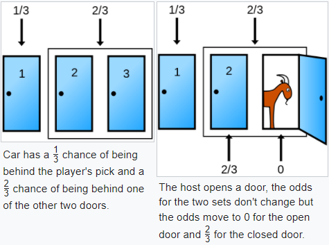
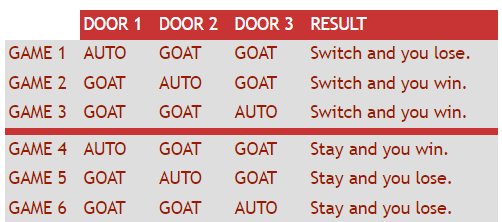

```{r setup, include=FALSE}
knitr::opts_chunk$set(echo = FALSE, warning = FALSE, message = FALSE)
```

```{r libs}
library(tidyverse)
```

```{=html}
<style>
.forceBreak { -webkit-column-break-after: always; break-after: column; }
</style>
```

## Monty Hall

::: {.centered}
{width="75%"}
:::

::: {.notes}
Monty Hall -- moderoval televizní show.
Soutěžící si vybral dveře, věděl, že za jednimi je auto, za dvěma jen koza.
Moderátor ze zbývajících dvou otevřel jedny, za kterými byla koza.
Soutěžící měl možnost zůstat při své volbě, nebo změnit volbu a vybrat si zbývající neotevřené dveře.
:::

## Marilyn vos Savant, nejvyšší IQ dle Guinnessovy knihy rekordů {.smaller}

Marilyn: Účastník by měl svoji volbu změnit.

<font size="5">

<blockquote>

I have been a faithful reader of your column, and I have not, until now, had any reason to doubt you.
However, in this matter (for which I do have expertise), your answer is clearly at odds with the truth.
James Rauff, Ph.D. Millikin University

</blockquote>

<blockquote>

May I suggest that you obtain and refer to a standard textbook on probability before you try to answer a question of this type again?
Charles Reid, Ph.D. University of Florida

</blockquote>

<blockquote>

You made a mistake, but look at the positive side.
If all those Ph.D.'s were wrong, the country would be in some very serious trouble.
Everett Harman, Ph.D. U.S. Army Research Institute

</blockquote>

</font>

::: {.notes}
Odpověď Marylin: Není to 1:1, protože musíme uvažovat předchozí pravděpodobnost -- ta byla pro 2.
a 3. dveře dohromady celkem 2/3. Vodítko pro intuici: 100 dveří, moderátor otevře 98 z 99 nevybraných.
[Jedno z nejlepších vláken historie internetu je k přečtení zde.](https://web.archive.org/web/20130121183432/http://marilynvossavant.com/game-show-problem/)
:::

## Monty Hall vizuálně 1

::: {.centered}

:::

<font size="2">[Zdroj Wikipedie](https://en.wikipedia.org/wiki/Monty_Hall_problem)</font>

## Monty Hall vizuálně 2

::: {.centered}
{width=70%}
:::

<font size="2">[Zdroj Wikipedie](https://en.wikipedia.org/wiki/Monty_Hall_problem)</font>


## Monty Hall vizuálně 3

::: {.centered}

:::

<font size="2">[Zdroj Marilyn vos Savant](https://web.archive.org/web/20130121183432/http://marilynvossavant.com/game-show-problem/)</font>

# Marilyn wins!
