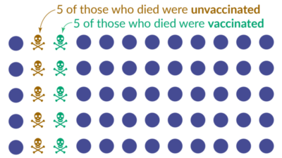
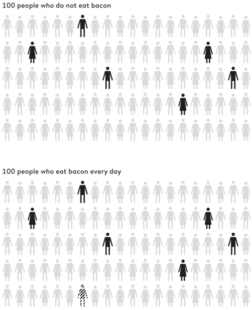

```{r setup, include=FALSE}
knitr::opts_chunk$set(echo = FALSE)
```

```{r libs}

library(cowplot)
library(ggplot2)

```

## Titulek v Hospodářských novinách

<blockquote>

"Na koronavirus letos [2021] zemřelo 24 tisíc Čechů, 80 procent z nich nebylo očkovaných."

</blockquote>

Co na základě tohoto výroku můžeme říct o účinnosti vakcín?

[Celý článek HN](https://domaci.hn.cz/c1-67017640-na-koronavirus-letos-zemrelo-24-tisic-cechu-80-procent-z-nich-nebylo-ockovanych)

::: {.notes}
Moc ne, minimálně bychom potřebovali znát podíl očkovaných. Ani to by vlastně nestačilo - je možné, že se očkuje jiný typ lidí. Ale tuhle otázku zatím necháme stranou.
:::

## Přehlížení výchozí pravděpodobnosti

Base rate fallacy



## Přehlížení výchozí pravděpodobnosti

```{r}
p1 <- ggdraw() + draw_image("figures/02_base_rate_1.png", scale = 0.9)
p2 <- ggdraw() + draw_image("figures/02_base_rate_2.png", scale = 0.9)

plot_grid(p1, p2)
```

[Zdroj obrázků Our World in Data](https://ourworldindata.org/covid-deaths-by-vaccination)

## Není většina jako většina

<blockquote>

Titulek na Britských listech: "Proč většina lidí, kteří už byli očkováni, nyní v Anglii umírá na covid?"

</blockquote>

To naštěstí není pravda. Ale většina umírajících jsou očkovaní. Pokud neznáme výchozí distribuci, nic moc nám to neříká.

[Celý článek BL](https://blisty.cz/art/104272-proc-vetsina-lidi-kteri-uz-byli-ockovani-nyni-v-anglii-umira-na-covid.html)

::: {.notes}
Většina lidí, kteří zemřou za volantem, používá bezpečnostní pás ;-)
:::

# Binární proměnné

0 vs. 1

## Relativní vs. absolutní riziko

-   Studie 1,3 miliónu pacientů, 3000 chirurgů za období 2007 až 2019

<blockquote>

Women 32% more likely to die after operation by male surgeon, study reveals

---[The Guardian](https://www.theguardian.com/society/2022/jan/04/women-more-likely-die-operation-male-surgeon-study)

</blockquote>

Jde o relativní, nebo absolutní risk?

## Je 32 % malé nebo velké číslo?

-   Zvýšení ze 3 z 10 na 4 z 10
-   Zvýšení z 3 z miliónu na 4 z miliónu

Obojí představuje zvýšení relativního rizika třetinu (32 %).

## Jaké bylo absolutní riziko úmrtí v této studii pro ženy?

-   5 z 1000, když operovala žena
-   6,6 z tisíce, když operoval muž

Nárůst absolutního rizika pro ženy tak odpovídal jednomu úmrtí navíc pro každých cca 625 operací žen prováděných mužskými chirurgy.

## Závěr?

Zajímavé, potenciálně závažné, ale relativní riziko může být zavádějící. Dobrým dalším krokem by mohlo být porovnání s jinými faktory (Například jak se od sebe liší různé nemocnice?) a přemýšlení o kauzálním mechanismu.

::: {.notes}
Asociace není kauzalita. Potenciální kauzální mechanismy: pro ženy je těžší stát se chirugy, uspějí jen ty nejlepší, jsou pak v průměru lepší než jejich mužští kolegové. Mužští chirurgové se více učí na mužských pacientech, mají menší zájem o odlišnosti ženského těla. Muži a ženy mezi chirurgy dostávají odlišně obtížné případy. Muži a ženy mezi chirurgy se věnují různým subdisciplínám s různými riziky. První observační studie s tímto závěrem - je potřeba další výzkum.
:::

## Absolutní vs. Relativní riziko - definice

::: {style="float: left; width: 45%;"}
### Absolutní riziko

Podíl lidí ve vymezené skupině, kteří v určeném časovém období prožijí sledovanou událost.
:::

::: {style="float: right; width: 45%;"}
### Relativní riziko

Když absolutní riziko u lidí, kteří jsou vystaveni působení zkoumaného jevu, označíme jako $p$ a absolutní riziko u lidí, kteří jevu vzstaveni nejsou, označíme jako $q$, pak relativní riziko můžeme definovat jako $p/q$.
:::

## Očekávané četnosti

Co to znamená pro 100 lidí? Tisíc lidí? V mnoha situacích asi srozumitelněší forma než pravděpodobnosti.

Viz např. [tuto studii v Cochrane Database](https://pubmed.ncbi.nlm.nih.gov/21412897/).

## Očekávané četnosti lze komunikovat také graficky

<center>

{width="35%"}

Zdroj obrázku @spiegelhalter2019

</center>

## Rámování: na prezentaci záleží

-   5% mortalita zní hůře než 95% přežití
-   99 % mladých Londýňanů nepáchá závažné násilí vs. ve městě je 10 000 mladých, kteří páchají závažné násilí
