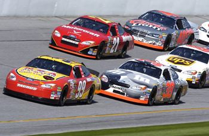

```{r setup, include=FALSE}
knitr::opts_chunk$set(echo = FALSE, warning = FALSE, message = FALSE)
```

```{r libs}
library(knitr)
library(kableExtra)
library(tidyverse)
library(cowplot)
library(ggplot2)

```

## Titulek v Hospodářských novinách

<blockquote>

"Na koronavirus letos [2021] zemřelo 24 tisíc Čechů, 80 procent z nich nebylo očkovaných."

</blockquote>

Co na základě tohoto výroku můžeme říct o účinnosti vakcín?

[Celý článek HN](https://domaci.hn.cz/c1-67017640-na-koronavirus-letos-zemrelo-24-tisic-cechu-80-procent-z-nich-nebylo-ockovanych)

::: {.notes}
Moc ne, minimálně bychom potřebovali znát podíl očkovaných. Ani to by vlastně nestačilo - je možné, že se očkuje jiný typ lidí. Ale tuhle otázku zatím necháme stranou.
:::

## Přehlížení výchozí pravděpodobnosti

Base rate fallacy


## Přehlížení výchozí pravděpodobnosti

```{r}
p1 <- ggdraw() + draw_image("figures/02_base_rate_1.png", scale = 0.9)
p2 <- ggdraw() + draw_image("figures/02_base_rate_2.png", scale = 0.9)

plot_grid(p1, p2)
```

[Zdroj obrázků Our World in Data](https://ourworldindata.org/covid-deaths-by-vaccination)

## Není většina jako většina

<blockquote>

Titulek na Britských listech: "Proč většina lidí, kteří už byli očkováni, nyní v Anglii umírá na covid?"

</blockquote>

To naštěstí není pravda. Ale většina umírajících jsou očkovaní. Pokud neznáme výchozí distribuci, nic moc nám to neříká.

[Celý článek BL](https://blisty.cz/art/104272-proc-vetsina-lidi-kteri-uz-byli-ockovani-nyni-v-anglii-umira-na-covid.html)

::: {.notes}
Většina lidí, kteří zemřou za volantem, používá bezpečnostní pás ;-)
:::

# Binární proměnné

0 vs. 1

## Relativní vs. absolutní riziko

-   Studie 1,3 miliónu pacientů, 3000 chirurgů za období 2007 až 2019

<blockquote>

Women 32% more likely to die after operation by male surgeon, study reveals

---[The Guardian](https://www.theguardian.com/society/2022/jan/04/women-more-likely-die-operation-male-surgeon-study)

</blockquote>

Jde o relativní, nebo absolutní risk?

## Je 32 % malé nebo velké číslo?

-   Zvýšení ze 3 z 10 na 4 z 10
-   Zvýšení z 3 z miliónu na 4 z miliónu

Obojí představuje zvýšení relativního rizika třetinu (32 %).

## Jaké bylo absolutní riziko úmrtí v této studii pro ženy?

-   5 z 1000, když operovala žena
-   6,6 z tisíce, když operoval muž

Nárůst absolutního rizika pro ženy tak odpovídal jednomu úmrtí navíc pro každých cca 625 operací žen prováděných mužskými chirurgy.

## Závěr?

Zajímavé, potenciálně závažné, ale relativní riziko může být zavádějící. Dobrým dalším krokem by mohlo být porovnání s jinými faktory (Například jak se od sebe liší různé nemocnice?) a přemýšlení o kauzálním mechanismu.

::: {.notes}
Asociace není kauzalita. Potenciální kauzální mechanismy: pro ženy je těžší stát se chirugy, uspějí jen ty nejlepší, jsou pak v průměru lepší než jejich mužští kolegové. Mužští chirurgové se více učí na mužských pacientech, mají menší zájem o odlišnosti ženského těla. Muži a ženy mezi chirurgy dostávají odlišně obtížné případy. Muži a ženy mezi chirurgy se věnují různým subdisciplínám s různými riziky. První observační studie s tímto závěrem - je potřeba další výzkum.
:::

## Absolutní vs. Relativní riziko - definice

::: {style="float: left; width: 45%;"}
### Absolutní riziko

Podíl lidí ve vymezené skupině, kteří v určeném časovém období prožijí sledovanou událost.
:::

::: {style="float: right; width: 45%;"}
### Relativní riziko

Když absolutní riziko u lidí, kteří jsou vystaveni působení zkoumaného jevu, označíme jako $p$ a absolutní riziko u lidí, kteří jevu vzstaveni nejsou, označíme jako $q$, pak relativní riziko můžeme definovat jako $p/q$.
:::

# Jak komunikovat binární proměnné

## Různé způsoby komunikace binárních proměnných

Tabulka shrnuje možné způsoby komunikace příkladu výše: úmrtí operovaných žen, když operuje žena, resp. když operuje muž.


```{r}
ukazatele <- tribble(~"Ukazatel", ~"Operuje žena", ~"Operuje muž",
                     "pravděpodobnost", "0.5 %", "0.66 %",
                     "očekávaná četnost", "5 ze 1000", "6.6 ze 1000",
                     "také očekávaná četnost", "1 z 200", "1 z 152",
                     "šance", "5 / 995", "6.6 / 993.4")

kbl(ukazatele) %>%
   kable_paper(bootstrap_options = c("hover", "condensed"))
```

## Různé způsoby srovnání mezi dvěma skupinami

Tabulka shrnuje různé způsoby, jak ze dvou různých čísel pro dvě různé skupiny udělat jedno číslo, které v sobě obsahuje srovnání.

```{r}
komparace <- tribble(~"Komparativní ukazatel", ~"Hodnota",
                     "Rozdíl v absolutním riziku", "0.16 %",
                     "Relativní riziko", "6.6 / 5 = 1.32, tedy 32% nárůst",
                     "Number Needed to Treat (NNT)", "100 / 0.16 = 625",
                     "Poměr šancí", "(6.6 / 993.4) / (5 / 995)  = 1.32")

kbl(komparace) %>%
   kable_paper(bootstrap_options = c("hover", "condensed"))
```


## Obě tabulky pro srovnání

```{r}
kbl(ukazatele) %>%
   kable_paper(bootstrap_options = c("hover", "condensed"))

kbl(komparace) %>%
   kable_paper(bootstrap_options = c("hover", "condensed"))
```

## Pravděpodobnost

$$\frac{\textrm{úspěchy}}{\textrm{pokusy}}$$
Pohybuje se od 0 do 1, případně od 0 % do 100 %.


## Očekávané četnosti

Co to znamená pro 100 lidí? Tisíc lidí? V mnoha situacích asi srozumitelněší forma než pravděpodobnost.

Viz např. [tuto studii v Cochrane Database](https://pubmed.ncbi.nlm.nih.gov/21412897/).

::: {.notes}
Zmiňovaná studie mj. říká: "Participants (health professionals and consumers) understood natural frequencies better than probabilities (SMD 0.69 (95% confidence interval (CI) 0.45 to 0.93))."
:::

## Očekávané četnosti lze komunikovat také graficky

<center>

{width="35%"}

Zdroj obrázku @spiegelhalter2019

</center>


::: {.notes}
Obrázek se váže k příkladu rakoviny tlustého střeva. Pokud lidé nejí procesované maso, 6 ze 100 bude mít v životě rakovinu tlustého střeva. Pokud jí denně ekvivalent 50 g slaniny, roste riziko ze 6 na 7.
:::


## Šance 

Angličtina zná termíny "chance" a "odds". Čeština oba překládá jako šance. To může být matoucí. Šance (chance) je neformální pojem, ale šance (odds) je ve statistice pojem jasně definovaný: poměr pozorování, kdy určitý jev nastane, a pozorování, kdy nenastane.

Tedy:

$$\frac{\textrm{úspěchy}}{\textrm{neúspěchy}}$$


Případně za využití pravděpodobnosti:

$$\frac{p}{1-p}$$

## Number Needed to Treat (NNT)

Medicínský ukazatel. Nevím o českém překladu. Může být užitečný i ve společenských vědách. 

$$\frac{100}{\textrm{rozdíl absolutním riziku procentech}}$$

## Poměr šancí

Zrádný ukazatel, v tuhle chvíli nadstavba.


$$ \frac{\frac{\textrm{úspěchy}_{\:skupina1}}{\textrm{neúspěchy}_{\:skupina1}}}{\frac{\textrm{úspěchy}_{\:skupina2}}{\textrm{neúspěchy}_{\:skupina2}}} $$

## Proč je poměr šancí zrádný?

>- V příkladu výše vycházel stejně jako relativní riziko: nárůst relativního rizika byl 32 %, poměr šancí byl 1.32. >- Blízkost k relativnímu riziku platí ale jen pro malá absolutní rizika. U velkých absolutních rizik to vůbec neplatí.

## 10% nárůst z 68 % na 70 %

???

>- Intervence zvýší riziko vedlejšího účinku z 68 % na 70 %.
>- Absolutní riziko se zvýšilo o ...
>- Relativní riziko se zvýšilo o ...
>- Jaký je poměr šancí?


::: {.notes}
Absolutní riziko se zvýšilo o 2 %. Relativní riziko je 70/68 = 1.03, tedy zvýšení o 3 %. Poměr šancí je (70/30)/(68/32) = 1.1, tedy 10% nárůst šance vedlejšího účinku u skupiny s intervencí.
:::

## Jak z toho ven?

- poměry šancí patří do statistických modelů, ne do mezilidské komunikace
- absolutní riziko nejlépe vyjádříme v tzv. procentních bodech
- relativní riziko je dobré komunikovat spolu s absolutním


## Politická strana XY měla v lednu podporu 20 % respondentů a v červnu 15 % respondentů. Tedy:

1) Podpora strany klesla o 5 %
1) Podpora strany klesla o 25 %
1) Podpora strany klesla o 5 p. b.


## Rámování: na prezentaci záleží

-   5% mortalita zní hůře než 95% přežití
-   99 % mladých Londýňanů nepáchá závažné násilí vs. ve městě je 10 000 mladých, kteří páchají závažné násilí

# Ostatní typy proměnných

## Metodologická perspektiva

- nominální (nominal)
- ordinální (ordinal)
- kardinální (cardinal, metric)

  - intervalové
  - poměrové 
  
::: {.notes}
Příklady intervalových proměnných: teplota ve stupních Celsia; letopočty, IQ,...  
:::
  
## Příklad

Na této fotografii je 6 aut. Vůz číslo "99" (se žlutou střechou) je na 1. pozici.



[Zdroj mathsisfun.com](https://www.mathsisfun.com/numbers/cardinal-ordinal-nominal.html#:~:text=Example%20With%20Everything&text=Car%20Number%20%2299%22%20(with,a%20name%20for%20the%20car))


## Alternativní prezentace

- Kvalitativní proměnné (kategorické)

  - Nominální
  - Ordinální
  
- Kvantitativní proměnné (numerické, metrické)

  - Intervalové
  - Poměrové
  

## Matematická perspektiva na kvantitativní proměnné

- Diskrétní proměnné (count variables)
- Spojité proměnné (continuous variables)


## Kategorická data - shrnutí

- Kategorická data jsou buď nominální, nebo ordinální.
- Jejich smyslem je uskupovat příbuzná pozorování.
- Často je analyticky uchopujeme skrze procenta a kontingenčí tabulky (viz Analytická propedeutika)
- Speciální kategorií kategorických dat jsou data binární či dichotomická. 

## Kategorizace dat

Kategorizace dat: Převod původně nekategorických dat na kategorická. 
Dichotomizace dat: Převod původně nebinárních dat na data binární.

## Reference v prezentaci


