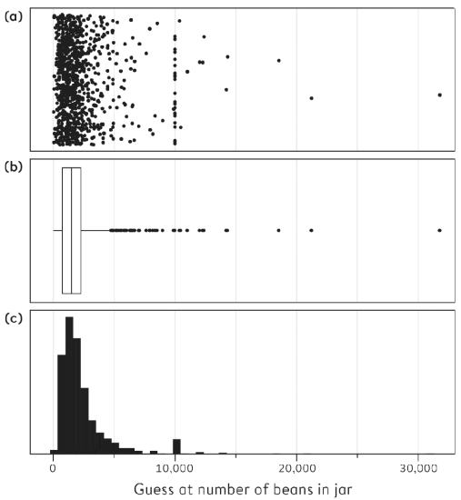

```{r setup, include=FALSE}
knitr::opts_chunk$set(echo = FALSE, warning = FALSE, message = FALSE)
```

```{r libs}
library(knitr)
library(kableExtra)
library(tidyverse)
library(patchwork)
library(scales)
library(here)
library(openintro) # for mammals dataset
library(ggrepel)
# library(fGarch) # for desired skew. finally unused to reduce pck dependency
```

```{=html}
<style>
.forceBreak { -webkit-column-break-after: always; break-after: column; }
</style>
```

## Typy proměnných - opakování {.columns-2}

-   nominální

-   ordinální

-   kardinální (metrické, numerické, kvantitativní)

    -   intervalové
    -   poměrové

<p class="forceBreak">

</p>

-   numerické diskrétní
-   numerické spojité

# Empirická distribuce dat

Tvar dat


## Moudrost davu: počet fazolek ve sklenici

<div class="centered">
{width=35%}
</div>

<font size="2">Zdroj: @spiegelhalter2019</font>

::: {.notes}
Fotografie ilustruje experiment, lidé měli odhadnout počet fazolek ve sklenici. Mediánový odhad byl lepší než 90 % individuálních odhadů, má ilustrovat tzv. moudrost davu - průměrná odpověď mnoha lidí často může vést ke slušnému odhadu, kdy náhodné chyby, kterým podléhají jednotlivci, se částečně vyruší. Nemusí ale dobře fungovat proti systematickým zkreslením.
:::

## Jak vizualizovat mnoho dat?

{width=90%}


::: {.notes}
Bodový graf - vynáší jednotlivé odhady na číselnou osu, v tomto grafu má význam jen horizontální dimenze, vertikální rozdíly jsou náhodně vygenerovány, aby se body nepřekrývaly. Box plot (krabicový graf) se nesnaží zobrazit pozorování přímo, ale skrze klíčové hodnoty: kvartily (o nich více později). Histrogram využívá pro zobrazení kategorizaci proměnné di intervalů.
:::


# Míry centrality

## Míry centrality (measures of central tendency)

Míry centrality se také nazývají míry polohy (measures of the location of the data distribution).

> -   (aritmetický) průměr - suma dělená počtem případů
> -   medián - prostřední hodnota z řady seřazené podle velikosti
> -   modus - nejčastější hodnota

::: {.notes}
**Průměr** - také střední hodnota. **Medián** - také prostřední hodnota, v případě lichého počtu pozorování je jasné, která hodnota je prostřední, v případě sudého počtu bereme průměr dvou prostředních hodnot. **Modus** - v jednom datovém souboru může být více hodnot, které se objevují stejně často, tedy módů může být více. Hovoříme například o bimodální distribuci dat. 
:::


## Aritmetický průměr z dat (sample mean)

$$\bar{x} = (x_1 + x_2 + … +x_n)/n$$

kde $x_1, x_2, …, x_n$ jsou jednotlivá pozorování a $n$ je počet těchto pozorování.

Zkrácený zápis:

$$\bar{x} = \frac{1}{n} \sum_{i=1}^n x_i $$

## Skoro všichni mají větší než průměrný počet nohou... {.columns-2 .smaller}

Průměr reprezentuje data v určitém smyslu, ale nemusí být reprezentativní v jiném smyslu.

<p class="forceBreak">

</p>

{width="80%"} 

<font size="2">Obrázek z [brilliant.org](https://brilliant.org/wiki/arithmetic-mean/)</font>

::: {.notes}
Další příklady: Bill Gates přijde do baru a najednou je v něm v průměru každý miliardář. Průměrný věk dožití v roce 1800 v Evropě byl 33 let. Ale přibližně třetina lidí zemřela do pěti let od narození. Pokud je vyloučíme, průměrný věk se blížil 60 let.
:::

## Už jsme viděli: Jak se šíří COVID

<div class="centered">
{width="45%"}
</div>

<font size="2">Převzato z @spiegelhalter2021</font>

::: {.notes}
Průměr užitečně modeluje naše očekávání ohledně počtu nakažených do budoucna, ale může být zavádějící z hlediska mechanismů (např. super spreaders), jak se nákaza šíří. 
:::

## Měli bychom tedy raději používat medián?

Studie Evropské centrální banky v roce 2013: německá mediánová domácnost je výrazně chudší než domácnosti středomořských zemí.

```{r}

wealth <- 
  tribble(~"země", ~"kategorie", ~"hodnota",
        "Německo", "mediánová domácnost", 51400,
        "Německo", "průměrná domácnost", 195200,
        "Německo", "průměr na osobu", 95500,
        "Francie", "mediánová domácnost", 115800,
        "Francie", "průměrná domácnost", 233400,
        "Francie", "průměr na osobu", 104100,
        "Itálie", "mediánová domácnost", 173500,
        "Itálie", "průměrná domácnost", 275200,
        "Itálie", "průměr na osobu", 108700,
        "Španělsko", "mediánová domácnost", 182700,
        "Španělsko", "průměrná domácnost", 291400,
        "Španělsko", "průměr na osobu", 108700) %>% 
  mutate(země = fct_relevel(země, c("Německo", "Francie", "Itálie", "Španělsko")),
         kategorie = fct_relevel(kategorie, c("mediánová domácnost", "průměrná domácnost", "průměr na osobu")))

wealth %>% 
  filter(kategorie == "mediánová domácnost") %>% 
  ggplot(aes(x=fct_reorder(země, hodnota), y = hodnota, fill = země))+
  geom_col()+
  labs(title = "Bohatství mediánové domácnosti v EUR",
       x=element_blank(), 
       y=element_blank(),
       caption = "The Household Survey (European Central Bank, 2013)") +
  geom_text(aes(label = format(hodnota, big.mark = " ", scientific = FALSE)), vjust = 1.5, color = "white")+
  scale_y_continuous(labels = number_format(suffix = " EUR",
                                            accuracy = 1))
  


```

Zdroj dat je [článek na voxeu.org](https://voxeu.org/article/are-germans-poorer-other-europeans-principal-eurozone-differences-wealth-and-income#fn)

::: {.notes}
Diskuse: velikost domácností, průměr vs. medián (pro agregované srovnání bohatství dvou zemí možná lepší průměr, medián dává možná větší smysl jako reference pro jednotlivce uvnitř země), míra vlastnictví bydlení (v Německu nejnižší, 44 % (pravděpodobně souvisí s významnou rolí sociálního bydlení v Německu(veřejné politiky jsou také část bohatství země),  zatímco 55 %, 69 % a 83 % ve Francii, Itálii a Španělsku). Cenové trendy u důležitých komponentů, kulturní odlišnosti v reportování, podíl finančních aktiv (častěji nereportovaná, v Německu více), bohatství národa a závisí i na bohatství veřejného sektoru.
:::

## Mediánová vs. průměrná domácnost

```{r}

wealth %>% 
  filter(kategorie == "mediánová domácnost" | kategorie == "průměrná domácnost") %>% 
  ggplot(aes(x = kategorie, y = hodnota, group = země, fill = země))+
  geom_col(position = "dodge", color = "black")+
  labs(title = "Bohatství průměrné vs. mediánové domácnosti v EUR",
       x=element_blank(), 
       y=element_blank(),
       caption = "The Household Survey (European Central Bank, 2013)") +
  scale_y_continuous(labels = number_format(suffix = " EUR",
                                            accuracy = 1))

```

## Zohlednění velikosti domácností

```{r}

wealth %>% 
  ggplot(aes(x = kategorie, y = hodnota, group = země, fill = země))+
  geom_col(position = "dodge", color = "black")+
  labs(title = "Bohatství průměrné a mediánové domácnosti a průměr na osobu v EUR",
       x=element_blank(), 
       y=element_blank(),
       caption = "The Household Survey (European Central Bank, 2013)") +
  scale_y_continuous(labels = number_format(suffix = " EUR",
                                            accuracy = 1))

```


# Kvantily: Kvartily, kvintily, decily, percentily

## Kvartily

- Analogické k mediánu, dělí seřazená data na čtyři stejné části.

>- Kolik je kvartilů?
>- Jaký je vztah mezi mediánem a 2. kvartilem?
>- Existuje více způsobů výpočtu kvartilů, nelamte si tím hlavu 

::: {.notes}
Pokud máme například číselnou řadu 1, 2, 3, 4, 5, není úplně jednoznačné, kde jsou jednotlivé kvartily. Je první kvartil číslo 2, tedy první číslo, pro které platí, že od začátku až po toto číslo je obsaženo 25 % pozorování? Nebo číslo 1,5 jako střed mezi 1 a 2? Ale pokud si představíme osu od 1 do 5, tak mezi 1 a 2 za sebou rozhodně nemáme 25 % cesty mezi oběma konci. Existuje více postupů výpočtu kvartilů, liší se především pro malé vzorky, kde ale kvartily moc nepotřebujeme. Proto to nebudeme řešit. 
:::


## Kvintily

- ... na 5 stejných částí


<fint size="2">[Obrázek převzat z statisticshowto.com](https://www.statisticshowto.com/quintile-definition/) s odvoláním na World Health Organization.</font> 


::: {.notes}
Kvintil může jednak znamenat hranici, jednak také danou pětinu. Například spodní kvintil se používá ve významu spodních 20 %. Pro míru nerovnosti se někdy používají metriky, ve kterých kvintil figurují, například metrika Income quintile share ratio (S80/S20) ukazuje poměr příjmů horního kvintilu vůči spodnímu kvintilu. V Česku se pohybuje kolem 3,5, což je v rámci evropského kontextu velmi málo. 
:::


## Decily

- ... na 10 stejných částí

## Percentily

- ... na 100 stejných částí. Kvantily jsou zpravidla na percentily převoditelné.


<font size="2">[Zdroj Statistika a My](https://www.statistikaamy.cz/o-slozitem-jednoduse/rozvetvena-rodina-kvantilu/)</font>

# Logaritmické měřítko

## Jak vizualizovat mnoho dat? {.columns-2}

### Původní měřítko

{width=90%}
<p class="forceBreak">

</p>

### Logaritmické měřítko

{width=90%}

::: {.notes}
Logaritmické měřítko zachycuje tempo růstu. Od vybrané hodnoty tak hodnota destkrát menší bude stejně daleko doleva, jako hodnota desetkrát větší doprava.
:::

## Logaritmus

Logaritmus: vyjadřuje, jakým číslem musíme umocnit daný základ, abychom dostali požadovaný výsledek.

$$log_28 = 3 $$

$$log_{10}100 = 2 $$

Ve statistice využívám zpravidla logaritmické měřítko při základu 10, které převádí čísla na jejich řády. Umožňuje společně vizualizovat velké a malé hodnoty (srazí je k sobě). 

## Příklad: savci a jejich mozky

```{r}
mammals %>% select(species, body_wt, brain_wt) %>% head(10) %>% kableExtra::kable()
```

<br>
<font size="2">Inspirováno [tutorialem Marvina Lemose](https://rstudio-pubs-static.s3.amazonaws.com/433476_9ce6707ae2794d96923b7258703fdff7.html)</font>

## Distribuce hmotností těl a mozků

```{r}

body <- ggplot(data = mammals, aes(body_wt)) + geom_histogram() + labs(x="Hmotnost těla [kg]", y = element_blank())
brain <- ggplot(data = mammals, aes(brain_wt)) + geom_histogram() + labs(x="Hmotnost mozku [g]", y = element_blank())

body + brain
```

## Vztah mezi hmotností těl a mozků

```{r}
ggplot(mammals, aes(body_wt, brain_wt)) + geom_point()
```

## Vztah na logaritmickém měřítku

```{r}

y_breaks = c(10^0, 10^1, 10^2, 10^3, 10^4)
x_breaks = c(10^-1, 10^0, 10^1, 10^2, 10^3)

backup_options <- options()
options(scipen = 999)
  
ggplot(data = mammals, aes(x = body_wt, y = brain_wt)) +
  geom_point(data = mammals %>% filter(species %in% c("Mouse", "Cat", "Baboon", "Man","Sheep", "Pig", "Cow")),
             colour = "orange", size = 3) +
  geom_point() +
  geom_smooth(method = "lm", se = F) +
  scale_x_log10(breaks = x_breaks) + 
  scale_y_log10(breaks = y_breaks)+
  labs(x = "Hmotnost těla [kg]",
       y = "Hmotnost mozku [g]")+
  geom_text_repel(data=mammals %>% filter(species %in% c("Mouse", "Cat", "Baboon", "Man", "Sheep", "Pig", "Cow")),
            aes(label=species))


options(backup_options)

```


::: {.notes}
Pokud zhruba platí, že člověk je v horizontální dimenzi stejně daleko od šimpanze jako od krávy, znamená to, že kráva je tolikrát těžší než člověk, kolikrát je člověk těžší než šimpanz.  
:::

## U logaritmického měřítka je častý vědecký zápis

```{r}
x_breaks_labs = scientific(x_breaks, digits = 2)
y_breaks_labs = scientific(y_breaks, digits = 2)


ggplot(data = mammals, aes(x = body_wt, y = brain_wt)) +
  geom_point() +
  geom_smooth(method = "lm", se = F) +
  scale_x_log10(breaks = x_breaks, labels = x_breaks_labs) + 
  scale_y_log10(breaks = y_breaks, labels = y_breaks_labs) +
  labs(x = "Hmotnost těla [kg]",
       y = "Hmotnost mozku [g]")

```

::: {.notes}
Vědecký zápis lze číst takto: uvažujte číslo před "e". Toto číslo má explicitně nebo implicitně desetinnou čárku, např. číslo 5 je 5,0. Posuňte desetinnou čárku o tolik míst, jaké číslo je za znakem -, resp. +. Pokud je znak minus, posouváme doleva, pokud plus, posouváme doprava. Například číslo 3,4e-04 tedy znamená: 0,00034.
:::


## Logaritmické měřítko a exponenciální růst

- Co je to exponenciální růst?

>- Exponenciální růst - něco se "x-násobí" za určitou časovou jednotku (zdvojnásobí, zdesetinásobí, ale i jen vynásobí 1.001)


::: {.notes}
Pověst o vynálezci šachů, který chtěl od sultána za hru tolik rýže, že na prvním poli bude jedno zrnko, na druhém dvě, pak čtyři a tak dál. Sultán radostně souhlasil, než se ukázalo, že si takovou cenu nemůže dovolit. Podobně hádanka o jezeře, kde se porost vodní rostlinou zdojnásobí každý den. 100. den rostlina akorát stihne pokrýt celé jezero. Kolikátý den pokryje půlku? 
:::

## Jak vypadá exponenciální růst?

```{r}
t <- 0:6
R1 <- 2
R2 <- 2.5
R3 <- 3
R4 <- 4
a <- 1

y1 <- R1^t
y2 <- R2^t
y3 <- R3^t
y4 <- R4^t

y5 <- y4 * c(1,1,1,0.95, 0.45, 0.18, 0.07) # zpočátku exponenciální, pak roste pomaleji
y6 <- c((1:7)^3) # roste pomaleji


exp_data <- 
  tibble(y1 = y1, y2 = y2, y3 = y5, y4 = y6, x = 0:6)


exp_data %>% 
  pivot_longer(cols = -x) %>% 
  ggplot(aes(x = x, y = value, group = name, color = name))+
  geom_point(size = 2)+
  geom_line()+
  labs(title = "Která z následujících křivek představuje exponenciální růst?",
       x= "Běh času",
       y= element_blank())+
  scale_x_continuous(breaks = 0:6)
```


## Zlogaritmování pomáhá rozpoznat exponenciální růst

```{r}

exp_data %>% 
  pivot_longer(cols = -x) %>% 
  mutate(value = log(value)) %>% 
  ggplot(aes(x = x, y = value, group = name, color = name))+
  geom_point(size = 2)+
  geom_line()+
  labs(title = "Stejná data jako na předchozím snímku po zlogaritmování",
       x= "Běh času",
       y= element_blank())+
  scale_x_continuous(breaks = 0:6)

```

::: {.notes}
Pokud proměnnou zlogaritmujeme, z exponenciálního růstu se stane přímka: lineární nárůst na logaritmickém měřítku totiž znamená, že v každém mezikroku je růst stejným násobkem předchozího stavu. Jasně tedy vidíme, že červená a zelená přímka představují exponenciální růst. Fialová nikdy nepředstavovala exponenciální růst. Modrá představovala exponenciální růst do bodu 3, ale pak začal růst zpomalovat. 
:::


# Robustní statistiky

## Co je robustní statistika?

-   Ukazetel, který není (příliš) ovlivněn extrémními hodnotami (odlehlými pozorováními).


## Průměr vs. medián (odstraněna jediná hodnota)

```{r}

"%ni%" <- Negate("%in%")

set.seed(42)
mammals <- bind_rows(mammals[-1,], mammals[1,]) %>% mutate(y_jitter = runif(n=nrow(mammals)))

mammals_but_ae <- mammals %>% filter(species %ni% c("Africanelephant"))

all_mean <- mean(mammals$body_wt) %>% round(1)
but_ae_mean <- mean(mammals_but_ae$body_wt) %>% round(1)

all_median <- median(mammals$body_wt) %>% round(1)
but_ae_median <- median(mammals_but_ae$body_wt) %>% round(1)

orig_all <- 
  mammals %>% 
  ggplot() + 
  geom_point(aes(x=body_wt, y=y_jitter)) +  
  scale_x_continuous(breaks = c(seq(0,6000, by=1000)),
                     limits = c(0,6999))+
  scale_y_continuous(breaks = NULL) + 
  labs(y = element_blank(),
       x = "Hmotnost těla [kg]")+
  geom_vline(xintercept = all_mean, color="red")+
  geom_vline(xintercept = all_median, color="blue")+
  geom_text(label = paste0("průměr = ",all_mean), color = "red", x=3000, y=0.4)+
  geom_text(label = paste0("medián = ",all_median), color = "blue", x=3000, y=0.6)


log_all <- 
  mammals %>% 
  ggplot() + 
  geom_point(aes(x=body_wt, y=y_jitter))+
  scale_x_log10(breaks = x_breaks,  limits = c(0.005,6999))+
  scale_y_continuous(breaks = NULL) + 
  labs(y = element_blank(),
       x = "Hmotnost těla [kg]") +
  geom_vline(xintercept = all_mean, color="red")+
  geom_vline(xintercept = all_median, color="blue")

orig_but <- 
  mammals_but_ae %>% 
  ggplot() + 
  geom_point(aes(x=body_wt, y=y_jitter)) +  
  scale_x_continuous(breaks = c(seq(0,6000, by=1000)),
                     limits = c(0,6999))+
  scale_y_continuous(breaks = NULL) + 
  labs(y = element_blank(),
       x = "Hmotnost těla [kg]")+
  geom_vline(xintercept = but_ae_mean, color="red")+
  geom_vline(xintercept = but_ae_median, color="blue")+
  geom_text(label = paste0("průměr = ",but_ae_mean), color = "red", x=3000, y=0.4)+
  geom_text(label = paste0("medián = ",but_ae_median), color = "blue", x=3000, y=0.6)

log_but <- 
  mammals_but_ae %>% 
  ggplot() + 
  geom_point(aes(x=body_wt, y=y_jitter)) +  
  scale_x_log10(breaks = x_breaks,  limits = c(0.005,6999))+
  scale_y_continuous(breaks = NULL) + 
  labs(y = element_blank(),
       x = "Hmotnost těla [kg]") +
  geom_vline(xintercept = but_ae_mean, color="red")+
  geom_vline(xintercept = but_ae_median, color="blue")


(orig_all + log_all) / (orig_but + log_but)

```


::: {.notes}
Odstraněna byla hodnota pro slona afrického. Graf na lineárním měřítku není příliš přehledný. Změna průměru a mediánu je lépe vyjádřena číselně. Pro logaritmické měřítko platí číselně stejné změny.
:::


## Oříznutý průměr

>- Oříznutý průměr (trimmed mean, truncated mean): průměr z hodnot po "oříznutí" určitého procenta extrémních (nejmenší a největších hodnot).
>- Medián potlačuje šikmost distribuce i extrémní případy, oříznutý průměr potlačuje především extrémní případy.
>- NADSTAVBA: Windsorized mean - podobný jako oříznutý, místo odříznutí ale hodnoty nahradí nejvyšší/nejnižší ještě neodstraněnou hodnotou.


::: {.notes}
Například oříznutý průměr na 90 % hodnot znamená, že se odstraní 5 % nejmenších a 5 % největších hodnot, z prostředních 90 % se spočítá průměr.
:::


# Jiné průměry

## Jiné průměry

-   vážený průměr
-   klouzavý průměr
-   geometrický průměr (nadstavba)
-   harmonický průměr (nadstavba)

::: {.notes}
**vážený průměr** - typicky výpočet průměru z agregovaných dat, kde známe počet pozorování v každé skupině. **klouzavý průměr** - v časových řádách pro zachycení trendu bez zbytečnéhu šumu. **geometrický průměr** - použití typicky při analýze přírůstků, např. průměrné tempo růstu HDP, průměrné inflace nebo průměrného úroku. **harmonický průměr** - v technických oborech, např. při měření průměrného času potřebného na výrovbu jednoho výrobku, když se vyrábí na více různě rychlých linkách.
:::

## Vážený průměr

$$\bar{x} = \frac{\sum_{i=1}^n x_i*w_i}{\sum_{i=1}^n w_i}  $$

kde $w_i$ jsou váhy jednotlivých pozorování

## Vážený průměr - příklad

```{r}
obyv <- read_csv2(here("data-input", "ec_population_structure_subset.csv"))

obyv %>% ggplot(aes(y=fct_reorder(country, `80-and-over`), x = `80-and-over`, fill = status)) + 
  geom_col() + 
  labs(title = "Podíl osob ve věku 80 a více\nna celkové populaci", 
       x = element_blank(), y = element_blank(),
       caption = "Zdroj dat: Eurostat")+
  scale_fill_discrete(name = element_blank(),
                      guide = guide_legend(reverse = TRUE))+
  scale_x_continuous(labels = percent_format(scale = 1, accuracy = 1))
  

```

Jak vypočítat podíl osob ve věku 80 a více v rámci EU?

## Příklad Itálie, Česko a Slovensko

```{r}

obyv_3 <- obyv %>% filter(country %in% c("Italy", "Czechia", "Slovakia")) %>% select(-status)
obyv_3$pop <- c(10.7, 59.55, 5.46)

```

-   Podíl 80 a více ČR = 4,1 %

-   Podíl 80 a více IT = 7,4 %

-   Podíl 80 a více SK = 3,4 %

-   Počet obyvatel ČR = 10 700 000

-   Počet obyvatel IT = 59 600 000

-   Počet obyvatel SK = 5 500 000

> -   Aritmetický průměr = $(4.1 + 7.4 + 3.4) / 3 = 4.97$
> -   Vážený průměr = $(4.1*10.7 + 7.4*59.6 + 3.4*5.5) / (10.7 + 59.6 + 5.5) = 6.64$

## Klouzavý průměr {.columns-2 .smaller}

{width="90%"}

<font size="2">@spiegelhalter2021</font>

<p class="forceBreak">

</p>

-   Tmavá plná čára = USA
-   Světlá plná čára = IT
-   Světlá prerušovaná čára = UK

# Nadstavba

## Geometrický průměr (nadstavba)

Pokud je růst HDP ve třech po sobě jdoucích letech 2 %, 20 % a 38 %, průměrný růst HDP je tedy 20 % (aritmetický průměr). Problém je, že pokud by byl třikrát po sobě narostlo HDP o 20 %, dospěli bychom k jinému výslednému HDP. Geometrický průměr je číslo, o které by každý rok muselo narůst HDP, abychom dospěli ke stejnému výsledku, jako když reálný růst byl 2, 20 a 38 %.

Jak se vyvíjelo HDP: $100*1.02*1.20*1.38 = 168.9$

Aritmetický průměr: $100*1.2*1.2*1.2 = 172.8$

## Výpočet geometrického průměru (nadstavba)

$$\bar{x}_G = \sqrt[n]{x_1*x_2*x_3 ... x_n}  $$ kde ${x_1*x_2*x_3 ... x_n}$ vyjadřují tempo růstu ve formátu, kdy 2 % jsou vyjádřena jako 1,02

Tedy v našem případě: $\sqrt[3]{1.02*1.20*1.38} = 1.191$

A lze snadno ověřit, že: $100*1.191*1.191*1.191 = 168.9$

## Harmonický průměr (nadstavba)

$$\bar{x}_H = \frac{n}{\frac{1}{n}*(\frac{1}{x_1}+\frac{1}{x_2}...\frac{1}{x_n})}  $$

$$\bar{x}_H = \frac{n}{\sum_{i=1}^n \frac{1}{x_i}}  $$

Linka A vyrobí produkt za 30 minut, linka B za 10 minut. Jak dlouho průměrně trvá vyrobit jeden výrobek? 20 minut je špatná odpověď, protože by vedla k predikci, že za hodinu vyrobím v průměru 3 výrobky na jedné lince, tedy 6 na obou dohromady. Ale ve skutečnosti vyrobím za hodinu 8 výrobků.

Výpočet pomocí harmonického průměru je: $2/(1/30 + 1/10) = 15$

Tedy průměrně na jedné lince výrobek za 15 minut, 4 za hodinu a celkem 8 výrobků za hodinu.

## Reference v prezentaci {.smaller}

Následuje seznam referencí, které v prezentaci neměly aktivní proklik na zdroj.
