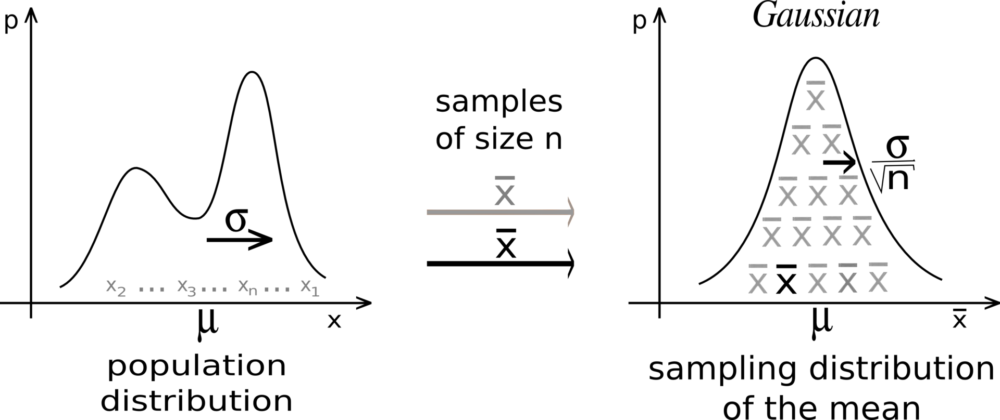
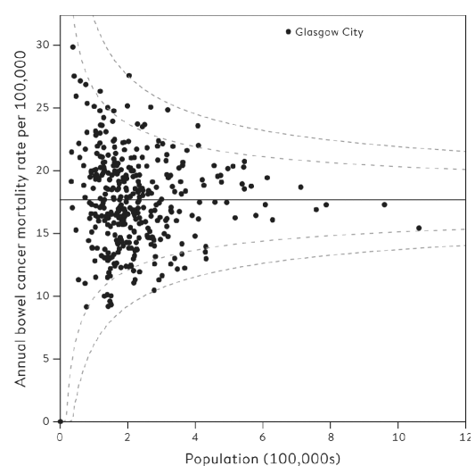

```{r setup, include=FALSE}
knitr::opts_chunk$set(echo = FALSE, warning = FALSE, message = FALSE)
```

```{r libs}
library(tidyverse)
library(patchwork)
```

```{=html}
<style>
.forceBreak { -webkit-column-break-after: always; break-after: column; }
</style>
```


## Důležitý koncepční rozdíl

1) Distribuce náhodné proměnné pozorované na např. jedincích ve výběrovém souboru
1) Distribuce statistiky teoreticky pozorovatelné na jednotlivých výběrových souborech

::: {.notes}
Pozor na pojmy. Statistika = (a) obor, (b) údaj popisující data, např. průměr (tedy statistika ve smyslu statistický ukazatel). Ve druhém smylu potom můžeme použít **distribuce statistiky** (angl. sampling distribution): pokud bychom realizovali mnoho výběrových souborů a z každého vyjádřili požadovanou statistiku (např. průměr), potom distribuce statistiky je distribuce těchto průměrů. Distribuce statistiky vychází z toho, že agregovaný ukazatel o datech můžeme také nahlížet jako náhodnou proměnnou.
:::

## Příklad: hod mincí

-   Náhodná proměnná: výsledek hodu mincí (hlava, nebo orel).
-   Agregace pomocí statistického ukazatele: počet hlav

::: {.centered}

:::

<font size="2">[Zdroj obrázku](https://www.prazskyden.cz/panna-nebo-orel-odkud-se-vzalo-souslovi-ktere-dnes-nedava-smysl/)</font>

## Kolik hlav očekávat?

```{r}

par(mfrow = c(2, 2))

# 1 hod

wins <- c(0:1)
totalFlips <- 1
probability <- .5

CoinFlips<- data.frame(wins=wins,probabilityXOrMoreWins = 1-pbinom(wins-1,totalFlips, probability), probabilityXWins=dbinom(wins,totalFlips,probability ))

# head(CoinFlips)
# tail(CoinFlips)

m1 <- ggplot(CoinFlips, aes(as_factor(wins), probabilityXWins)) +
  geom_col() + 
  labs(title = paste0("Počet hodů: ", totalFlips), 
        x = "Počet hlav", 
        y = "Pravděpodobnost")

# 2 hody

wins <- c(0:2)
totalFlips <- 2
probability <- .5

CoinFlips<- data.frame(wins=wins,probabilityXOrMoreWins = 1-pbinom(wins-1,totalFlips, probability), probabilityXWins=dbinom(wins,totalFlips,probability ))

m2 <- ggplot(CoinFlips, aes(as_factor(wins), probabilityXWins)) +
  geom_col() + 
  labs(title = paste0("Počet hodů: ", totalFlips), 
        x = "Počet hlav", 
        y = "Pravděpodobnost")


# 3 hody

wins <- c(0:3)
totalFlips <- 3
probability <- .5

CoinFlips<- data.frame(wins=wins,probabilityXOrMoreWins = 1-pbinom(wins-1,totalFlips, probability), probabilityXWins=dbinom(wins,totalFlips,probability ))

m3 <- ggplot(CoinFlips, aes(as_factor(wins), probabilityXWins)) +
  geom_col() + 
  labs(title = paste0("Počet hodů: ", totalFlips), 
        x = "Počet hlav", 
        y = "Pravděpodobnost")

# 10 hodů

wins <- c(0:10)
totalFlips <- 10
probability <- .5

CoinFlips<- data.frame(wins=wins,probabilityXOrMoreWins = 1-pbinom(wins-1,totalFlips, probability), probabilityXWins=dbinom(wins,totalFlips,probability ))


m4 <- ggplot(CoinFlips, aes(as_factor(wins), probabilityXWins)) +
  geom_col() + 
  labs(title = paste0("Počet hodů: ", totalFlips), 
        x = "Počet hlav", 
        y = "Pravděpodobnost")

(m1 + m2) / (m3 + m4)

```


::: {.notes}
UŽ zde si lze všimnout zárodku centrální limitní věty: Zatímco proměnná "výsledek hodu mincí" má uniformní alternativní rozdělení (pro každé pozorování padne buď hlava, nebo orel), pro agregaci ve smyslu pravděpodobnosti, že padne určitý daný počet hlav, vidíme, jak se její tvar s počtem hodů blíží normálnímu rozdělení.
:::


## Příklad: kolik podporovatelů, když p = 0.2


```{r}
par(mfrow = c(2, 3))


n <- 5
k <- seq(0, n, 1)
plot (k, dbinom(k, n, 0.2), type = "l", ylab = "density",
      main = "n=5, p=0.2")

n <- 10
k <- seq(0, n, 1)
plot (k, dbinom(k, n, 0.2), type = "l", ylab = "density",
      main = "n=10, p=0.2")

n <- 20
k <- seq(0, n, 1)
plot (k, dbinom(k, n, 0.2), type = "l", ylab = "density",
      main = "n=20, p=0.2")

n <- 50
k <- seq(0, n, 1)
plot (k, dbinom(k, n, 0.2), type = "l", ylab = "density",
      main = "n=50, p=0.2")

n <- 100
k <- seq(0, n, 1)
plot (k, dbinom(k, n, 0.2), type = "l", ylab = "density",
      main = "n=100, p=0.2")


n <- 1000
k <- seq(0, n, 1)
plot (k, dbinom(k, n, 0.2), type = "l", ylab = "density",
      main = "n=1000, p=0.2")


par(mfrow = c(1, 1))
```


## Centrální limitní teorém (CLT)

Pokud agregujeme náhodnou proměnnou pomocí sumy nebo průměru, potom distribuce této agregující statistiky bude mít tendenci (posilující s rostoucí velikostí výběrového souboru) k normálnímu rozdělení, nehledě na původní distribuci náhodné proměnné.

## Vlastnosti distribuce průměru náhodné proměnné dle CLT {.smaller}

Předpoklad: Výběrový soubor je velký.

-   Normální rozdělení
-   Průměr distribuce se překrývá s populačním průměrem náhodné proměnné
-   Směrodatná odchylka distribuce průměru se rovná směrodatné odchylce v populaci děleno odmocninou z n

Směrodatnou odchylku distribuce statistiky nazýváme STANDARDNÍ CHYBA (standard error, S.E.)

::: {.centered}
{width="60%"}
:::

<font size="2">[Zdroj obrázku Wiki](https://en.wikipedia.org/wiki/Central_limit_theorem)</font>

## Kdy platí CLT?

- (Téměř) nezávisle na distribuci pozorované proměnné, pokud je N dostatečně velké

Dostatečně velké?

- Zpravidla se uvádí větší než 30, ale záleží na šikmosti proměnné (někdy je potřeba větší N, aby CLT začal platit)
- U binomického rozdělení se řídíme pravidlem, že $minimum(n*p; n*q) >= 5$. Pokud podmínka splněna není, na CLT bychom neměli spoléhat.

## CLT a mírně šikmá data - ilustrace

* Šedá: původní data (pozorovaná proměnná) 
* Barvy: rozdělení průměru, n = 5, 20, 40

::: {.centered}
{width=50%}
:::

<font size="2">[Zdroj obrázku statisticsbyjim.com](https://statisticsbyjim.com/basics/central-limit-theorem/)</font>

Je vidět, že červené rozdělení v sobě ještě trochu šikmosti má. 

## Mají lidé v některých oblastech Velké Británie až trojnásobnou pravděpodobnost na rakovinu střev?

BBC: "[Threefold Variation in UK Bowel Cancer Death Rates](https://www.bbc.com/news/health-14854019)"

... 9 per 100,000 people in Rossendale in Lancashire to 31 per 100,000 inhabitants of Glasgow City.

## Jaké rozdíly sledujeme vs. jaké očekáváme? {.smaller}

::: {.centered}
{width=45%}
:::

<font size="2">Obrázek z @spiegelhalter2019</font>

Přerušované čáry zachycují 95% a 99,7% intervaly spolehlivosti pro jednotlivé velikosti územních celků. 


::: {.notes}
Centrální limitní věta je užitečná i v tom, že nás učí očekávat variabilitu v malých vzorcích. Například smrt na rakovinu střeva je v populaci poměrně vzácná příhoda (ročně se týká asi 15 až 20 osob z každých 100 000 obyvatel). Pokud se podívámena podíl takto zemřelých za jednotlivé územní celky (v případě na snímku v Británii), jistě uvidímě rozdíly. Potřebují nějaké vysvětlení? To záleží na tom, jestli jsou větší, než jaké bychom čekali čistě náhodou. CLT nám pomáhá nahlédnout, že každý územní celek je vlastně vzorek, takže hodnota reprezentující celek by měla jako agregující statistika sledovat normální rozdělení s tím, že čím větší celek, tím blíže k populačnímu průměru by měly dopadat jednotlivé údaje pro územní celky.
:::


## Proč nás CLT především zajímá?

Umožňuje nám usuzovat ze vzorku na populaci (podstata inferenční statistiky).

## Základní kroky statistické inference {.smaller}

1) Teorie pravděpodobnosti predikuje interval, ve kterém očekáváme, že se s danou pravděpodobností (např. 95 %) bude nacházet naše statistika (např. průměr) získaná z výběrového souboru (čili vzorku)
1) Pozorujeme náhodný výběrový soubor (vzorek), spočítáme statistiku (např. průměr)
1) Spočítáme interval věrohodných populačních parametrů (takových, které jsme ochotni na základě pozorovaných dat považovat za plausibilní, protože naše statistika se vyskytuje v jejich 95% predikčním intervalu). Tomuto intervalu říkáme "95% konfidenční interval"
1) Význam 95 % je ten, že pokud bychom výběr vzorku opakovali mnohokrát, náš konfidenční interval by skutečný populační parameter (skutečný průměr) překryl v 95 % případů

Číslo 95 je zde zcela arbitrární (i když nejčastěji používané). Můžete za něj dosadit libovolné jiné, třeba 89 nebo 97.

## Konfidenční interval

Intuitivně: Interval možných populačních parametrů, pro které je naše pozorovaná statistika věrohodným důsledkem. Ovšem při subjektivním určení hranice "věrohodnosti". 

Exaktně: Pokud bychom náš experiment realizovali mnohokrát, konfidenční interval by v daném procentu případu překrýval skutečnou populační hodnotu. 

::: {.notes}
Tedy 99% konfidenční interval by skutečnou hodnotu nepřekrýval jen v jednom ze 100 případů (v průměru z obrovského množství pokusů), zatímco 50% konfidenční interval v polovině případů. 
:::

## Počítání konfidenčního intervalu CI na základě CLT

- Jako bodový odhad použijeme popisnou statistiku z výběrového souboru, např. 

$$
\bar{X}
$$

- Pro intervalový odhad: Od bodového odhadu odečteme z-násobek standardní chyby (minimum intervalu) a přičteme z-násobek standardní chyby (maximum intervalu). V případě 95% konfidenčního intervalu $z ≈ 2$, resp. často se uvádí přesněji $z = 1,96$  


$$
CI(95) = <\bar{X} - 2*SE; \bar{X} + 2*SE > 
$$

## Z-score

Poloha daného pozorování vyjádřená v počtu směrodatných odchylek od průměru. Má smysl především v kontextu normálního rozdělení.

$$
Zscore = \frac{x_i-\bar{x}}{S_x},
$$

kde $\bar{X}$ je průměr z výběrového souboru a $S_x$ je výběrový směrodatná odchylka.

## Jak používat z-score v normálním rozdělení

::: {.centered}

:::

<font size="2">Zdroj obrázku [statisticsbyjim.com](https://statisticsbyjim.com/hypothesis-testing/z-table/)</font>

Převod z-skóru na pravděpodobnost:

* Pomocí tabulek
* Pomocí softwaru

## Převod z-skóru na pravděpodobnost pomocí tabulek


::: {.centered}
{width=45%}
:::

<font size="2">Zdroj obrázku [statisticsbyjim.com](https://statisticsbyjim.com/hypothesis-testing/z-table/)</font>


## Převod z-skóru na pravděpodobnost pomocí softwaru

Například v Excelu můžete použít funkci norm.dist(), resp. norm.s.dist().

## Co ovlivňuje konfidenční interval

- N: čím větší, tím užší
- rozptyl: čím větší, tím širší
- požadovaná úroveň spolehlivosti: čím větší, tím širší


## Jaká je úroveň spolehlivosti konfidenčních intervalů na obrázku?

::: {.centered}
{width=40%}
:::

<font size="2">[Zdroj obrázku Wiki](https://en.wikipedia.org/wiki/Confidence_interval)</font>

::: {.notes}
Protože jen polovina intervalů překrývá skutečnou hodnotu, můžeme předpokládat, že jde nejspíš přibližně o 50% konfidenční interval.
:::


## Nesprávné interpretace konfidenčního intervalu

Číslo 95 si libovolně nahraďte jiným procentem. 

* 95% interval spolehlivost neznamená, že 95 % pozorování původní proměnné leží v tomto intervalu
* Konkrétní 95% konfidenční interval neznamená, že u 95 % opakovaných experimentů by sledovaná statistika spadla do tohoto intervalu
* Podle frekventistické teorie pravděpodobnosti (mainstream) konfidenční interval neznamená ani to, že existuje 95% pravděpodobnost, že daný interval překrývá skutečnou populační hodnotu. 


## Reference

