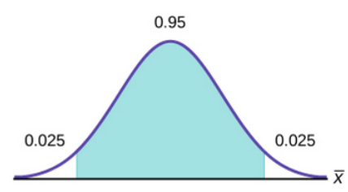

```{r setup, include=FALSE}
knitr::opts_chunk$set(echo = FALSE, warning = FALSE, message = FALSE)
```

```{r libs}
library(tidyverse)
library(patchwork)
```

```{=html}
<style>
.forceBreak { -webkit-column-break-after: always; break-after: column; }
</style>
```


## CLT - shrnutí {.smaller}

1) Co říká CLT?
1) Co je to standardní chyba?
1) Co je to konfidenční interval?
1) Jak na základě CLT počítáme konfidenční interval?

::: {.notes}
**1)** Distribuce průměrů (i jiných agregací) náhodné proměnné bude mít s rostoucím N tendenci k normálnímu rozdělení nehledě na distribuci proměnné. **2)** SE je směrodatná odchylka distribuce agregujících statistik (sampling distribution). Počítá se jako směrodatná odchylka původní proměnné delěná odmocninou z N. Proč odmocninou? Čím větší vzorek, tím měné nové informace přináší nová pozorování. **3)** Interval možných populačních parametrů, pro které je naše pozorovaná statistika věrohodným důsledkem, resp. formálně: pokud bychom náš experiment realizovali mnohokrát, konfidenční interval by v daném procentu případů překrýval skutečnou populační hodnotu. **4)** Viz další slide.
:::

## Jak na základě CLT počítáme konfidenční interval?

1) Provedeme bodový odhad (k tomu CLT nepotřebujeme).
1) Od něj odečteme (spodní hranice) a přičteme (horní hranice) "chybu odhadu" (margin of error).
1) Chyba odhadu? Na základě CLT pomocí z-skoŕu normálního rozdělení

$$
CI = \bar{X} \mp z*SE
$$

## Kde se bere hodnota z? {.smaller}

Z-skór normálního rozdělení pro $\alpha/2$, kde:

$$
\alpha = hladina\;významnosti = (100  - hladina\;spolehlivosti)/100
$$  

- Například pro 95% interval spolehlivosti je hladina spolehlivosti 95 %
- Tedy $\alpha = 0,05$ a $\alpha/2 = 0,025$  


::: {.centered}
{width=50%}
:::

<font size="2">[Zdroj obrázku](https://courses.lumenlearning.com/odessa-introstats1-1/chapter/a-single-population-mean-using-the-normal-distribution/)</font>

Hledáme tedy Z(0.025), např.v Excelu: =NORM.INV(0,975;0;1), což vrátí hodnotu 1,96.


## Chyba odhadu pomocí Studentova t rozdělení (NADSTAVBA) {.smaller}

Pokud má náhodná proměnná normální rozdělení, pak konfidenční interval získáme dle následujícího vzorce:


$$
CI = \bar{X} \mp t * SE,
$$

kde samozřejmě opět platí, že: 

$$
SE = \frac{s}{\sqrt{n}}
$$

t je hodnota t-rozdělení (vyčteme z tabulek) pro daný počet stupňů volnosti (degrees of freedom). DF = n - 1.

::: {.notes}
t rozdělení je symetrické rozdělení podobné normálnímu, ale pro malý počet pozorování má "těžší konce". Od cca 30 pozorování se v podstatě překrývá s normálním rozdělením. Využití však spíše například v biologii, kde náhodné proměnné mají normální rozdělení a kde počet pozorování bývá někdy v experimentech malý.
:::

## Co ovlivňuje šíři konfidenčního intervalu?

>-    Počet pozorování ve výběrovém souboru (N)
>-    Variabilita v populaci
>-    Požadovaná úroveň spolehlivosti

::: {.notes}
**Variabilitu v populaci** neznáme, použijeme variabilitu ve vzorku, abychom ji odhadli. Tomu se říká plug-in princip.
:::


## Cvičení: Jak konstruovat interval spolehlivosti pro binární proměnnou? {.smaller}

Návrat k příkladu příznivců trvalé hybridní výuky.

* X ... proměnná, zda příznivec hybridní výuky (1), nebo ne (0). Pr(X=příznivec) = $p_X$.
* Výběrový soubor n = 200
* Počet příznivců ve výběrovém souboru = 40
* OTÁZKA: Jaký je bodový a intervalový odhad (90% konfidenční interval) hodnoty $p_X$? 

Doporučený postup:

1) Jakou pravděpodobnostní distribuci má proměnná X?
1) Jak z pozorovaných dat nalezneme bodový odhad očekávané hodnoty této distribuce?
1) Jak nalezneme rozptyl této distribuce? 
1) Jak směrodatnou ochylku?
1) Jakou pravděpodobnostní distribuci má bodový odhad očekávané hodnoty? Proč?
1) Jaká je směrodatná odchylka pravděpodobnostní distribuce bodového odhadu očekávané hodnoty?
1) Jaká je Z-hodnota pro 90% konfidenční interval?

# Co je to vlastně pravděpodobnost?

## Co je to vlastně pravděpodobnost?

Paradox: experti se shodnou na "matematice" pravděpodobnosti, ale neshodnou se na tom, co to pravděpodobnost vlastně je.

1) **Klasická definice**: Poměr počtu jevů "úspěšných" dělený celkovým počtem možných jevů za předpokladu, že všechny jevy jsou stejně pravděpodobné.
1) **Frekventistická definice**: Výskyt jevu v nekonečné sérii stejných experimentů. Jádro mainstreamové statistiky.
1) **Subjektivní pravděpodobnost**: Úsudek konkrétní osoby o konkrétní situaci založený na informacích, které má tato osoba k dispozici. Lze interpretovat jako sázkový kurz (u malých sázek). Jádro bayesovské statistiky.


::: {.notes}
**Klasická definice**: například hody kostkou a pravděpodobnost sudého čísla. Ale, trochu cirkulární. **Frekventistická definice**: Vzpomeňte na konfidenční interval: "... ve velkém množství opakovaných pokusů by překryl skutečnou hodnotu v 95 % případů." **Subjektivní pravděpodobnost** základ bayesiánské statistiky, na vzestupu. Interpretace jako sázkový kurz: Například pokud mi někdo nabídne 100 Kč, když správně spočítám bonusový úkol, a já jsme ochotný dát 60 Kč jako nevratnou vstupenku do této sázky, je moje subjektivní pravděpodobnost 60 %. 
:::

## Jak interpretovat pravděpodobnost?

Pr(na minci padne hlava) = 0.5

* Frekventisté: Pokud bychom mnohokrát hodili touto mincí, v 50 % by padla hlava.
* Bayesiánci: Na to, že padně hlava, bych vsadil s kurzem 1:1.

## Jak se liší jejich přístup ke statistice? {.columns-2 .smaller}

### Populační parametr

* **Frekventisté**: Populační parametr je jedna fixní (většinou neznámá) hodnota.
* **Bayesiánci**: Populační parametr je hodnota, která se s určitou pravděpodobností vyskytuje v daném intervalu.

<p class="forceBreak">

</p>

### Intervalové odhady

* **Frekventisté**: Interval spolehlivost je interval, který bude napříč velkým počtem vzorků obsahovat skutečnou hodnotu (populační parametr) s danou pravděpodobností.
* **Bayesiánci**: Interval kredibility je interval, který s danou pravděpodobností obsahuje skutečnou hodnotu (populační parametr).


## Frekventisté vs. Bayesiánci - konkrétní příklad

Jak interpretovat, že podpora politické strany má 95% interval spolehlivosti <26 %; 29 %>?

* **Frekventisté**: Pokud bychom opakovaně tahali velké množství vzorků stejné velikosti z populace a pro každý z nich spočítali 95% interval spolehlivosti, 95 % z nich by obsahovalo skutečnou hodnotu podpory strany. Rozpětí těchto intervalů by mělo cca 3 procentní body.
* **Bayesiánci**: Na 95 % je skutečná podpora strany něco mezi 26 a 29 procenty

