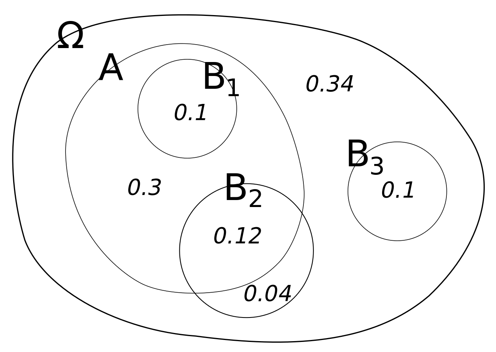

```{r setup, include=FALSE}
knitr::opts_chunk$set(echo = FALSE)
```

## Podmíněná pravděpodobnost

>-    Jaká je pravděpodobnosti jevu A, když víme, že nastal jev B? 
>-    Značíme $P(A|B)$

## Podmíněná pravděpodobnot vizuálně

::: {.centered}
{width=70%}
:::

<font size="2">[Zdroj Wiki](https://en.wikipedia.org/wiki/Conditional_probability)</font>


::: {.notes}
"Illustration of conditional probabilities with an Euler diagram. The unconditional probability P(A) = 0.30 + 0.10 + 0.12 = 0.52. However, the conditional probability P(A|B1) = 1, P(A|B2) = 0.12 ÷ (0.12 + 0.04) = 0.75, and P(A|B3) = 0." (Wiki)
:::

## Dvě čtyřstěnné kostky

Jaká je pravděpodobnost, že součet hodnot bude rovný šesti, pokud na jedné z kostek padlo číslo menší než tři?

$P((K_1 + K_2 = 6) | (K_1 < 3\;OR\;K_2 < 3))$

::: {.notes}
Ilustrativně řešit vypsáním všech možností. Výsledek je 1/6, zatímco nepodmíněná pravděpodobnost tohoto součtu je 3/16. 
:::

## Vzorec podmíněné pravděpodobnosti

$$
P(A|B) = \frac{P(A \cap B)}{P(B)}
$$


## Klasický příklad podmíněné pravděpodobnosti

Při screeningu rakoviny prsu je mamografie zhruba z 90 % přesná v tom smyslu, že 90 % žen s rakovinou a 90 % žen bez rakoviny bude správně klasifikováno. Předpokládejme, že 1 % vyšetřovaných žen má skutečně rakovinu: jaká je pravděpodobnost, že náhodně vybraná žena bude mít pozitivní mamograf, a pokud ano, jaká je šance, že má skutečně rakovinu?


::: {.notes}
Pokud řešíte vzorcem, základem je správně si to označit, například: P(A) = rakovina. P(B) = pozitivní test. 
:::


## Řešení pomocí vzorce

P(A) ... rakovina

P(B) ... pozitivní test

$P(B)$ ... 0.99 * 0.1 + 0.01 * 0.9 = 0.108 = ca 10.8 %

$P(A \cap B)$ ... 0.01 * 0.9 = 0.9 %

$P(A|B)$  = 0.9/10.8 = ca 8 %

## Řešení skrze očekávané četnosti

Co by se stalo ve velké skupině, řekněme 1000 žen? 

>-    990 nemá rakovinu, z nich 10 %, tedy 99 dostane pozitivní nález
>-    10 má rakovinu, z nich 90 %, tedy 9 dostane pozitivní nález
>-    Podil nemocných ze všech pozitivních nálezů je tedy 9 / (99 + 9) = 8 %

## Každá pravděpodobnost je podmíněná

Co by mohl tento výrok znamenat?

::: {.notes}
I pokud se bavíme například o pravděpodobnosti, že padne na spravedlivé minci hlava, děláme předpoklady v tom smyslu, že například mince nespadne hranou do nějaké spáry, někdo cizí ji nechytí ve vzduchu a neuteče, nespadne meteorit, takže se před dopadem mince vypaří. Jinými slovy, kdykoliv aplikujeme teorii pravděpodobnosti na reálný svět, nemůžeme si být jistí, co vlastně jsou všechny možnosti, co by se mohlo stát.
:::

## Bayesova věta {.smaller}


$$
P(A|B) = \frac{P(B|A)*P(A)}{P(B)} \;\;\;\;\;[Bayesova\;věta]
$$
Pomáhá počítat s podmíněnou pravděpodobností. Odvozena přímo se základního vzorce.

Symetricky:

$$
P(A|B) = \frac{P(A \cap B)}{P(B)} \;\;\;\;\;[2]
$$
$$
P(B|A) = \frac{P(A \cap B)}{P(A)} \;\;\;\;\;[3]
$$
Tedy ze [3] plyne:

$$
P(A \cap B) = P(B|A)*P(A) \;\;\;\;\;[4]
$$
Ze vzorce [4] plyne, že dosazením výrazu $P(B|A)*P(A)$ za $P(A \cap B)$ ve vzorci [2] získáme Bayesovu větu.

## Příklad na využití Bayesovy věty

-   Spáchán trestný čin.
-   Svědek: "pachazel byl Asiat"
-   Ve městě žije 15% Asiatů

Policie podrobí svědka pokusu na jeho spolehlivost (za podobného osvětlení mu  v náhod. pořadí přivádějí k rozpoznání  Asiaty / ne Asiaty).
Svědek má přesnost 80 % jak ve správném určení Asiatů, tak ne-Asiatů. 

Jaká je pravděpodobnost, že pachatel byl Asiat?


::: {.notes}
Doporučený zápis: P(+) ... svědek řekne, že je osoba je Asiat. P(A) ... osoba skutečně je Asiat.	**P(+| A) = 80%; P(-|  non A) = 80%;
?  P(A|+)** 
::: 
