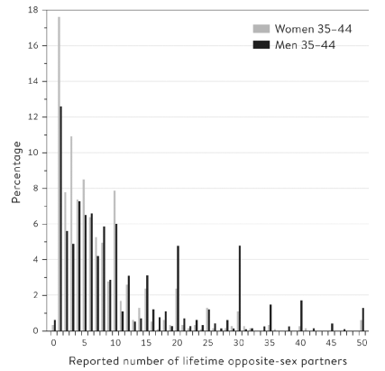

```{r setup, include=FALSE}
knitr::opts_chunk$set(echo = FALSE, warning = FALSE, message = FALSE)
```

```{r libs}
library(tidyverse)
```

```{=html}
<style>
.forceBreak { -webkit-column-break-after: always; break-after: column; }
</style>
```

## Cíle statistiky 

-   Deskripce dat (deskriptivní statistika)
-   Inference z pozorovaných dat na nepozorované skutečnosti

Typy inference: ze vzorku na populaci, prediktivní, kauzální

::: {.notes}
Zatím jsme v kurzu měli data, která jsme se učili popisovat (míry centrality, variability, vztahy). Ale proč to vlastně děláme? Často nás nezajímají jen data v ruce, ale chceme dělat závěry s obecnější platností. Tomu se říká inference. My budeme dnes největší pozornost věnovat inferenci ze vzorku na populaci (podobně jako Statistika 2 v příštím semestru), nicméně poznání, které nám tento typ inference umožní, je hodně užitečné i pro prediktivní a kauzální inferenci.
:::


# Populace

## Porodní hmotnost

Ženě se narodilo dítě o hmotnosti 2,91 kg. Je to hodně, nebo málo? Jak moc? Měli by mít rodiče obavy?

::: {.notes}
Probírali jsme zatím empirickou distribuci ve smyslu "tvaru" pozorovaných dat. Nyní se zaměříme na populační distribuci. Tu můžeme chápat jednak v analogickém smyslu: tvar dat pro celou populaci (kterou ale málokdy pozorujeme celou). Vedle toho ji ale můžeme chápat jako pravděpodobností rozdělení, ze kterého se "generují" jednotlivá pozorování. (To nepopisuje realitu, ale je to užitečný model.) Zmíněné dítě můžeme považovat za vzorek (n=1) z populačního rozdělení porodních vah.
:::

## Porodní hmotnost - populační rozdělení

::: {.centered}
{width="40%"}
:::

<font size="2"> Převzato z [@spiegelhalter2019]</font>


## Proč je dobré znát populační rozdělení?

::: {.notes}
Diskuse ve třídě. Mělo by zaznít: Znalost populačního rozdělení nám umožní dát pozorování do matematického kontextu: jaký je dítě percentil, kolik směrodatných odchylek od průměru atp. Skutečnost, že takto lehké nebo lehčí dítě se narodí asi v jednom z devíti případů sama o sobě neodpovídá, zda by rodiče měli mít obavy. Musíme mít další oborové znalosti, abychom věděli, že rizikovost této porodní váhy je zanědbatelně nízká.
:::


# Inference

## Inference

Na základě známých (pozorovaných) faktů se snažíme říct něco o skutečnostech, které neznáme (nepozorujeme).

Na rozdíl od příkladu výše (porodní váha) parametry skutečné populace v sociologickém výzkumu většinou neznáme, ale naopak se je snažíme odvodit z omezených pozorování.

::: {.notes}
Mluvit o skutečnostech, které neznáme, se zdá jako bláhové, nicméně inferenční statistika nabízí velmi mocné nástroje, jak o to alespoň smysluplně usilovat, i když naše závěry nikdy nebudou zcela jisté. V empirické vědě říkáme, že si nikdy nejsme ničím jisti na 100 %.
:::

## Proces inference

1)  Data
2)  Závěry o výběrovém souboru (a.k.a. sample) (popisná statistika)
3)  Závěry o základním souboru (a.k.a. study population) (inferenční statistika)
4)  Závěry o (cílové) populaci (a.k.a. target population) (freestyle)

::: {.notes}
Rozdíl mezi základním souborem a cílovou populací: Základní populace = mají šanci na výběr. Například lidé s telefonním číslem, pokud sběr provádíme náhodným vytáčením čísel. Nebo neziskové organizace v CZ, PL, HU a SK, pokud právě v těchto zemích oslovujeme organizace pro výzkum. Cílová populace = objekt výzkumu, tedy ti, o kom chceme dělat závěry. Například dospělá populace ČR, neziskové organizace v postkomunistických zemích. Obhájit mezeru/nejistotu v přechodu od interpretace základního souboru k cílové populaci je trochu freestyle, který nemá jasná pravidla.
:::

## Rizika inference {.columns-2 .smaller}

1)  Data
2)  Závěry o vzorku (popisná statistika)
3)  Závěry o studované populaci (inferenční statistika)
4)  Závěry o cílové populaci (freestyle)

<p class="forceBreak">

</p>

-   Přechod mezi každými dvěma stupni poznávacího procesu v sobě nese nějaká rizika.

    -   Přechod z 1 na 2: chyby měření (viz kurz Sociologický výzkum)
    -   Přechod z 2 na 3: design studie, validita (viz kurz Sociologický výzkum) + inferenční statistika
    -   Přechod z 3 na 4: dosažitelnost těch, koho chceme zkoumat

# Výběrový soubor a intervalové odhady

## Výběrový soubor (čili vzorek)

::: {.centered}
{width="80%"}
:::

Dva klíčové parametry vzorku jsou jeho velikost a reprezentativita.

::: {.notes}
O velikosti a reprezentativitě vzorku se budete učit detailně v rámci kurzu Sociologický výzkum, zde jen ve zkratce.
:::

## Validita a reliabilita v souvislosti se vzorkem

::: {.centered}
{width="70%"}
:::

## Problém bodových odhadů ze vzorku

<blockquote>

In January 2018 the BBC News website announced that over the three months to the previous November, 'UK unemployment fell by 3,000 to 1.44 million'. The reason for this fall was debated, but nobody questioned whether this figure really was accurate. [@spiegelhalter2019]

</blockquote>


>-    Je to hodně, nebo málo? S jakou přesností bylo číslo změřeno?

::: {.notes}
Číslo ve skutečnosti nebylo tak přesné, aby z něj šlo usuzovat na jakoukoliv změnu, chyba odhadu zveřejněná britskou ONS byla +- 77 000. Skutečné číslo tedy mohlo klidně ležet někde mezi poklesem o 80 000 a nárůstem nezaměstnanosti o 74 000.
:::

## Chyba odhadu (margin of error)

Pokud na základě výběrového souboru konstruujme bodový odhad (například průměr), údaj o chybě odhadu říká, jak moc velká nejistota je s tímto odhadem spojena.

::: {.notes}
S analogickým problémem už jsme se setkali - regresní analýza říká, kde pro danou hodnotu prediktoru můžeme v průměru očekávat hodnotu závislé proměnné. Ale neříká, jak moc se jednotlivá pozorování budou od tohoto průměrného očekávání lišit. Podmíněná očekávaná hodnota v regresi, určená regresním koeficientem, je bodový odhad. Pokud chceme dělat závěry o základním souboru, je ale potřeba nějak zachytit také míru nejistoty.
:::

## Latinka pro vzorek, řecká písmena pro populaci

m ... sample mean, průměr z dat

$\mu$ ... population mean, průměrná hodnota v nepozorované populaci

s ... výběrová směrodatná odchylka

$\sigma$ ... populační směrodatná odchylka

## Velikost vzorku a přesnost odhadu (zákon velkých čísel)


::: {.notes}
Zákon velkých čísel: pokud opakujeme náhodný výběr z populace mnohokrát, průměrná pozorovaná hodnota se bude velmi blížit skutečné hodnotě v populace. Například 10krát ještě není mnohokrát. Provést náhodný výber 100 pozorování je už lepší, ale průměrná chyba je pořád docela velká. Míra přesnosti odhadu je teoreticky arbitrární: pro každou přesnost lze určit velikost vzorku. Nicméně: (a) vzorky větší než jednotky tisíc se v sociologii prakticky nevyskytují kvůli ceně. (b) z důvodu jiných zdrojů chyb nemá smysl o větší přesnost stejně usilovat. 
:::

## Interval spolehlivosti

Interval spohlivosti = statistický mainstream pro vyjádření nejistoty intervalovým odhadem

::: {.centered}
{width="55%"}
:::

Interval spolehlivosti na hladině 5 % (neboli 95% interval spolehlivosti) překryje skutečnou hodnotu v populaci v 95 % případů.


::: {.notes}
Ve statistice dnes fungují dvě dominantní paradigmata: tzv. frekvenční a tzv. bayesiánské. Liší se v tom, jak v teoretické rovině definují pravděpodobnost (viz příští přednáška). Ve výuce statistiky převažuje frekvenční paradigma (také u nás na katedře), kam spadají intervaly spolehlivosti. Analogií bayesiánské statitistiky jsou intervaly věrohodnosti, s odlišnou interpretací.  
:::

## Problém srovnávání napříč průzkumy

::: {.centered}
{width="90%"}
:::

<font size="2">[Obrázek vygenerován pomocí Rocknpoll](http://rocknpoll.graphics/)</font>

## Jak vyváříme intervalové odhady?

Základ inferenční statistiky a testování nulových hypotéz v kurzu Statistika 2.

-   Tato přednáška: bootstraping a intuice za intervalovými odhady
-   Příští přednáška: teorie pravděpodobnosti
-   Další přednáška: centrální limitní věta

## Bootstrapování intervaloých odhadů {.columns-2 .smaller}

Počet sexuálních partnerů mužů ve věku 35 až 44 let. N = 769.

{width="65%"}

<p class="forceBreak">

</p>

{width="65%"}

<font size="2">Převzato z [@spiegelhalter2019]</font>


::: {.notes}
Obrázek vlevo vychází ze vzorku N = 50. Horní panel je rozložní odpovědí v tomto vzorku. Toto rozložní dokážeme sumarizovat nějakou statistikou, například průměrem. Ale jak přesná je tato sumarizace vzhledem k populaci? Resp. jinými slovy, jaká je s tímto odhadem spojená nejistota? To naznačuje bootstraping čili "převzorkování" (resampling) s opakováním. Obrázek vpravo ukazuje rozložení odhadů průměru pro 1000 bootstrapů z různě velkých vzorků (tzv. sampling distribution). 
:::

## Bootstrapování

Způsob generování intervalů spolehlivosti bez teorie pomocí hrubé výpočetní síly: ze vzorku vytváříme mnoho alternativních vzorků stejné velikosti pomocí náhodného výběru s opakováním (tzv. resampling with replacement). Sledujeme míru variability ve výsledných odhadech sledované statistiky (např. průměru).

## Rozložení bodového odhadu (sampling distribution)

Pravděpodobnostní rozložení bodového odhadu (například průměru nebo regresního koeficientu), pokud bychom sesbírali velké množství výběrových souborů a z každého bychom spočítali bodový odhad.

## Vlastnosti rozložení bodového odhadu {.columns-2 .smaller}

{width="65%"}

<p class="forceBreak">

</p>

{width="65%"}

<font size="2">Převzato z [@spiegelhalter2019]</font>

::: {.notes}
Všimňete si: původní distribuce je velmi šikmá. Distribuce bodových odhadů s rostoucím počtem pozorování v jednom výběru jsou: symetrické, vyšší (více koncentrované, méně nejistoty) a jejich průměr má tendenci splývat s průměrem původních dat. Tyto vlastnosti jsou klíčové pro většinu inferenční statistiky, více viz přednáška o centrální limitní větě.   
:::

# Populace jako pravděpodobnostní rozdělení

## Různé konceptualizace populace

-   Populace v jednoduchém slova smyslu - konečná populace, např. identifikovatelná skupina jedinců (dospělé osoby v ČR)
-   Superpopulace - větší populace neexistuje, ale my ji předpokládáme

::: {.notes}
Superpopulace je trochu neintuitivní koncept, který využíváme především v situacích, když máme všechna data, ale je užitečé předpokládat, že jsou výsledkem výběru vzorku z teoretického pravděpodobnostního rozdělení. Například pokud pacienty opakovaně měříme, více měření neexistuje, ale předpokládáme, že by existovat mohlo. Když hodím X-krát kostkou, více hodů neexistuje, ale předpokládám, že by existovat mohlo. Superpopulace tak zastupuje tzv. "data-generating" mechanismus, neboli pravděpodobnostní rozdělení, ze kterého "taháme" jednotlivá skutečná pozorování.
:::

## Proč je užitečný koncept superpopulace?

-   Srovnání vražednosti ve dvou zemích
-   Srovnání výpovědí na dvou odděleních
-   ...

> -   Koncept superpopulace zpochybňuje poučku, že: Pokud pozorujeme celou populaci, nelze provádět inferenční statistiku.

::: {.notes}
Zpravidla máme informace o všech vraždách (nebo skoro všech). Takže srovnat dvě země je celkem spolehlivé. Ale značí pozorovaný rozdíl skutečný rozdíl ve vražednosti, nebo mohlo jít o náhodnou oscilaci mezi dvěma zeměmi se stejnou mírou rizika, že bude člověk zavražděn? Podobně podíl výpovědí v dané firmě například za rok sledujeme přesně. Ale značí rozdíl, že jedno oddělení má inherentně vyšší obrat zaměstnanců, nebo je to náhodná oscilace? Koncept superpopulace pomáhá odpovědět.
:::


## Stavební plán pro statistickou inferenci

-   Pravděpodobnostní rozdělení: Teoretický model toho, jak jsou data generována
-   Teorie pravděpodobnosti: postup od modelu populace k datům (jaká data můžeme předpokládat, když známe/předpokládáme model)
-   Inference: postup od dat k modelu populace


::: {.notes}
**Pravděpodobnostní rozdělení** jako model má vlastnosti modelu, tedy nemá popisovat přesně skutečnost, ale užitečně ji abstrahovat. Ve skutečnosti není porodní váha každého dítěte dána náhodným losem z pravděpodobnotní distribuce, ale je dána nespočetným množství faktorů na genetické, chemické a fyzikální úrovni. Ve vědě zpravidla usilujeme o poznávání reality skrze inferenci, tedy postupujeme od dat k modelu. Pochopení obráceného postupu (od pravděpodobnostního modelu k datům) nám umožňuje vyvíjet a zvládnout nástroje, které pak používáme pro inferenci.
:::

## Stavební plán pro statistickou inferenci: druhý pokus o vysvětlení

Pokud známe nebo předpokládáme populační rozdělení, můžeme říct, jak jsou různá pozorování (jednotlivě nebo v kombinaci) překvapivá. 

Statistická inference: Máme pouze pozorování reality. Uděláme předpoklad o populačním rozdělení. Pokud je naše pozorování reality příliš překvapivé, zamítneme náš předpoklad.


<!---


## Normální rozdělení ve vazbě na boxplot

::: {.centered}
{width="65%"}
:::

<font size="2">Courtesy of Jan Netík</font>

-->


## Reference
