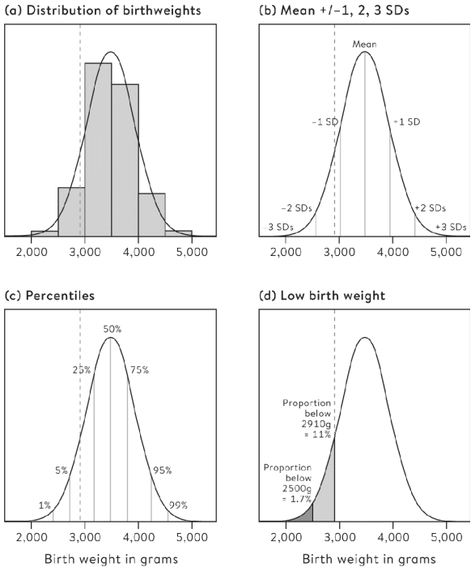
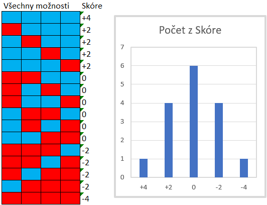
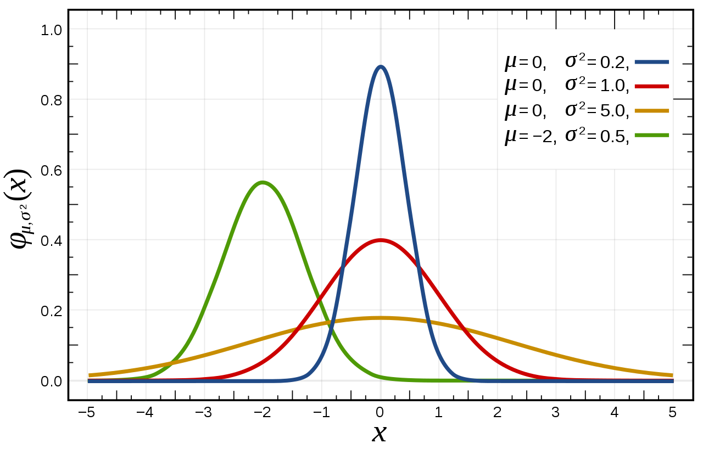

```{r setup, include=FALSE}
knitr::opts_chunk$set(echo = FALSE, warning = FALSE, message = FALSE)
```

```{r libs}
library(tidyverse)
```

```{=html}
<style>
.forceBreak { -webkit-column-break-after: always; break-after: column; }
</style>
```

## Cíle statistiky 

-   Deskripce dat (deskriptivní statistika)
-   Inference z pozorovaných dat na nepozorované skutečnosti

Typy inference: ze vzorku na populaci, prediktivní, kauzální

::: {.notes}
My budeme největší pozornost věnovat inferenci ze vzorku na populaci (podobně jako Statistika 2 v příštím semestru), nicméně poznání, které nám tento typ inference umožní, je hodně užitečné i pro prediktivní a kauzální inferenci.
:::


# Populace

## Porodní hmotnost - populační rozdělení 1/2

Ženě se narodilo dítě o hmotnosti 2,91 kg. Ví, že je to podprůměrná hmotnost. Ale jak moc? Měla by mít obavy?

::: {.notes}
Probírali jsme zatím empirickou distribuci ve smyslu "tvaru" našich dat. Nyní se zaměříme na populační distribuci ve smyslu populačního rozdělení dat. To ještě nabyde na významu, až si představíme různé způsoby konceptualizace pojmu populace. Zmíněné dítě můžeme považovat za vzorke (n=1) z populačního rozdělení porodních vah.
:::

## Porodní hmotnost - populační rozdělení 1/2

::: {.centered}
{width="40%"}
:::

<font size="2"> Převzato z [@spiegelhalter2019]</font>

## Různé konceptualizace populace

> -   Populace v původním slova smyslu - identifikovatelná skupina jedinců, z nich se snažíme získat vzorek v sociologickém výzkumu
> -   Virtuální populace - například pokud pacienty změříme několikrát denně = vzorek z virtuální populace všech teoreticky možných měření. Nebo když hodímě X-krát kostkou = vzorek ze všech možných hodů
> -   Metaforická populace - žádná větší populace neexistuje, ale my se chováme, jako že ano

::: {.notes}
Metaforická populace je trochu neintuitivní koncept, který využíváme především v situacích, když máme všechna data. Proč to děláme? Protože i zde je užitečné předpokládat, že celá empirická populace pochází z nějaké hypotetické/metaforické či prostě jen teoretické meta-populace.
:::

## Proč je užitečný koncept metaforické populace?

-   Srovnání vražednosti ve dvou zemích
-   Srovnání výpovědí na dvou odděleních
-   ...

> -   Koncept metaforické populace zpochybňuje poučku, že: Pokud pozorujeme celou populaci, nelze provádět inferenční statistiku.

::: {.notes}
Zpravidla máme informace o všech vraždách (nebo skoro všech). Takže srovnat dvě země je celkem spolehlivé. Ale značí pozorovaný rozdíl skutečný rozdíl ve vražednosti, nebo mohlo jít o náhodnou oscilaci mezi dvěma zeměmi se stejnou mírou rizika, že bude člověk zavražděn? Podobně podíl výpovědí v dané firmě například za rok sledujeme přesně. Ale značí rozdíl, že jedno oddělení má inherentně vyšší obrat zaměstnanců, nebo je to náhodná oscilace? Koncept metaforické populace pomáhá odpovědět.
:::

# Inference

## Inference

Na základě známých (pozorovaných) faktů se snažíme říct něco o skutečnostech, které neznáme (nepozorujeme).

Na rozdíl od příkladu výše (porodní váha) parametry skutečné populace v sociologickém výzkumu většinou neznáme, ale naopak se je snažíme odvodit z omezených pozorování.

::: {.notes}
Mluvit o skutečnostech, které neznáme, se zdá jako bláhové, nicméně inferenční statistika nabízí velmi mocné nástroje, jak o to alespoň smysluplně usilovat, i když naše závěry nikdy nebudou zcela jisté. V empirické vědě říkáme, že si nikdy nejsme ničím jisti na 100 %.
:::

## Proces inference

1)  Data
2)  Závěry o vzorku (popisná statistika)
3)  Závěry o studované populaci (inferenční statistika)
4)  Závěry o cílové populaci (freestyle)

::: {.notes}
Rozdíl mezi studovanou a cílovou populací: například pokud jsou studovanou populací myši, ale studujeme je proto, abychom se dozvěděli něco o lidech = velká mezera/nejistota mezi studovanou a cílovou populací. Příklad v sociologii: vybíráme vzorky nevládních organizací jen z několika zemí, ale snažíme se něco říct o všech post-komunistických zemích. Chceme něco říct o populaci ČR, ale děláme náhodný výběr z domácností (ne všichni žijí v domácnosti, někdo je bez domova nebo v instituci).
:::

## Rizika inference {.columns-2 .smaller}

1)  Data
2)  Závěry o vzorku (popisná statistika)
3)  Závěry o studované populaci (inferenční statistika)
4)  Závěry o cílové populaci (freestyle)

<p class="forceBreak">

</p>

-   Přechod mezi každými dvěma stupni poznávacího procesu v sobě nese nějaká rizika.

    -   Přechod z 1 na 2: chyby měření (viz Sociologický výzkum)
    -   Přechod z 2 na 3: design studie, validita (viz Sociologický výzkum) + inferenční statistika
    -   Přechod z 3 na 4: dosažitelnost těch, koho chceme zkoumat (viz Sociologický výzkum)

# Vzorek a intervalové odhady

## Vzorek čili výběrový soubor

::: {.centered}
{width="80%"}
:::

Dva klíčové parametry vzorku jsou jeho velikost a reprezentativita.

::: {.notes}
O velikosti a reprezentativitě vzorku se budete učit detailně v rámci předmětu Sociologický výzkum
:::

## Validita a reliabilita v souvislosti se vzorkem

::: {.centered}
{width="70%"}
:::

## Problém bodových odhadů ze vzorku

<blockquote>

In January 2018 the BBC News website announced that over the three months to the previous November, 'UK unemployment fell by 3,000 to 1.44 million'. The reason for this fall was debated, but nobody questioned whether this figure really was accurate. [@spiegelhalter2019]

</blockquote>

::: {.notes}
Číslo ve skutečnosti vůbec nebylo přesné, chyba odhadu zveřejněná britskou ONS byla +- 77 000. Skutečné číslo tedy mohlo klidně ležet někde mezi poklesem o 80 000 a nárůstem nezaměstnanosti o 74 000.
:::

## Rozpětí chyby (margin of error)

Pokud na základě vzorku konstruujme bodový odhad (například průměr), rozpětí chyby říká, kde bychom věrohodně mohli čekat skutečnou hodnotu v populaci.

::: {.notes}
S analogickým problémem už jsme se setkali - regresní analýza říká, kde pro danou hodnotu prediktoru můžeme v průměru očekávat hodnotu závislé proměnné. Ale neříká, jak moc se jednotlivá pozorování budou od tohoto průměrného očekávání lišit. Podmíněná očekávaná hodnota je bodový odhad. Znát míru nejistoty je ale také důležité.
:::

## Latinka pro vzorek, řecká písmena pro populaci

m ... sample mean, průměr z dat

$\mu$ ... population mean, průměrná hodnota v nepozorované populaci

s ... výběrová směrodatná odchylka

$\sigma$ ... populační směrodatná odchylka

## Velikost vzorku a přesnost odhadu (zákon velkých čísel)


::: {.notes}
Zákon velkých čísel: pokud opakujeme náhodný výběr z populace mnohokrát, průměrná pozorovaná hodnota se bude velmi blížit skutečné hodnotě v populace.
:::

## Nejistota vyjádřená jako intervalový odhad

::: {.centered}
{width="65%"}
:::

Interval spolehlivosti na hladině 5 % (neboli 95% interval spolehlivosti) překryje skutečnou hodnotu v populaci v 95 % případů.

## Problém srovnávání napříč průzkumy

::: {.centered}
{width="90%"}
:::

<font size="2">[Obrázek vygenerován pomocí Rocknpoll](http://rocknpoll.graphics/)</font>

## Jak vyváříme intervalové odhady?

Základ inferenční statistiky

-   Tato přednáška: bootstraping a intuice za intervalovými odhady
-   Příští přednáška: teorie pravděpodobnosti
-   Další přednáška: centrální limitní věta

## Intervalové odhady pomocí bootstrapování: počet sexuálních partnerů {.columns-2 .smaller}

{width="60%"}

<p class="forceBreak">

</p>

{width="60%"}

<font size="2">Převzato z [@spiegelhalter2019]</font>


::: {.notes}
Obrázek vlevo vychází ze vzorku N = 50. Horní panel je rozložní odpovědí v tomto vzorku. Toto rozložní dokážeme sumarizovat nějakou statistikou, například průměrem. Ale jak přesná je tato sumarizace vzhledem k populaci? Resp. jinými slovy, jaká je s tímto odhadem spojená nejistota? To naznačuje bootstraping čili "převzorkování" (resampling) s opakováním. Obrázek vpravo ukazuje rozložení odhadů průměru pro 1000 bootstrapů z různě velkých vzorků.
:::

## Bootstrapování

Způsob generování intervalů spolehlivosti bez teorie pomocí hrubé výpočetní síly: ze vzorku vytváříme mnoho alternativních vzorků stejné velikosti pomocí náhodného výběru s opakováním (tzv. resampling with replacement). Sledujeme míru variability ve výsledných odhadech sledované statistiky (např. průměru).

# Populace jako pravděpodobnostní rozdělení

## Populace jako pravděpodobnostní rozdělení

Populace udává pravděpodobnostní rozdělení pro jednotlivá pozorování. (Například: s jakou pravděpodobností uvidíme u náhodně vybraného novorozence porodní váhu 2,91 kg nebo nižší.)

## Pravděpodobnostní rozdělení

-   Teoretický model toho, jak jsou data generována
-   Inference: postup od dat k modelu
-   Pravděpodobnost: od modelu k datům (jaká data můžeme předpokládat, když známe model)

::: {.notes}
**Pravděpodobnostní rozdělení** jako model má vlastnosti modelu, tedy nemá popisovat přesně skutečnost, ale užitečně ji abstrahovat. Ve skutečnosti není porodní váha každého dítěte dána náhodným losem z pravděpodobnotní distribuce, ale je dána nespočetným množství faktorů na genetické, chemické a fyzikální úrovni. Ve vědě zpravidla usilujeme o poznávání reality skrze inferenci, tedy postupujeme od dat k modelu. Pochopení obráceného postupu (od pravděpodobnostního modelu k datům) nám umožňuje vyvíjet a zvládnout nástroje, které pak používáme pro inferenci.
:::


## Normální rozdělení (zvonová křivka, Gaussova křivka)

::: {.centered}
{width="65%"}
:::

<font size="2">Courtesy of Jan Netík</font>

::: {.notes}
Normální rozdělení typicky vzniká tam, kde jevy vznikají v důsledku mnoha malých vlivů. Působení těchto vlivů se častěji "vykrátí" (některé přidávají, jiné ubírají). Jen výjimečně se stane, že všechny malé vlivy "táhnou" stejným směrem. Viz intuice na dalším snímku.
:::

## Jak vzniká normální rozdělení? Vytvoření intuice

::: {.centered}

:::

::: {.notes}
V hypotetickém příkladu ovlivňují výsledek jen čtyři faktory. Ty mohou každý nabývat polohy +1 (modrá), nebo -1 (červená). Je vidět, že možné výsledky dávají vzniknout normálnímu rozdělení.
:::

## Normální rozdělení a směrodatné odchylky

::: {.centered}
{width="65%"}
:::

<font size="2">Zdroj [Wikipedia](https://en.wikipedia.org/wiki/Normal_distribution)</font>

Pravidlo tří sigma (68-95-99,7)

## Normální rozdělení - formální definice (nadstavba)

::: {.centered}

:::

Vypadá to děsivě, ale pí a eulerovo číslo jsou konstanty, x zastuje hodnoty proměnné, takže jediné, co vám stačí, je $\mu$ a $\sigma$, tedy průměr a směrodatná odchylka.

Jinými slovy: normální rozdělení je plně efinováno dvěma parametry: průměrem a směrodatnou odchylkou.

## Různá normální rozdělení

::: {.centered}
{width=80%}
:::

<font size="2">[Převzato z Wikipedie](https://cs.wikipedia.org/wiki/Norm%C3%A1ln%C3%AD_rozd%C4%9Blen%C3%AD#:~:text=Norm%C3%A1ln%C3%AD%20rozd%C4%9Blen%C3%AD%20neboli%20Gaussovo%20rozd%C4%9Blen%C3%AD,%2C%20p%C5%99edpisem%20nebo%20modelem%E2%80%9C.))</font>

>- Mezi jaké hodnoty spadá prostředních 68 % modrého rozdělení?
>- Kolik procent prostředních pozorování zeleného rozdělení spadá mezi hodnoty -5 a 1?
>- Kolik procent prostředních pozorování červeného rozdělení spadá mezi hodnoty -1 a 2?

## Rovnoměrné (uniformní) rozdělení

-   Všechny hodnoty jsou stejně zastoupené

```{r}

tibble(value = as_factor(1:6),
       prob = 1/6) %>% 
  ggplot(aes(x = value, y = prob)) + 
  geom_col() + 
  labs(x = "Hodnota na kostce", y = "Pravděpodobnost dané hodnoty", title = "Diskrétní uniformní rozdělení - hod kostkou") +
  scale_y_continuous(labels = scales::label_percent())
  

```

::: {.notes}
Pozor, existuje rozdíl mezi diskrétním a spojitým rozdělením. Tomu se budeme více věnovat v příští přednášce o pravděpodobnosti.
:::

## Diskrétní rovnoměrné rozdělení - průměr a rozptyl (nadstavba)

-   a ... minimum
-   b ... maximum
-   n ... počet možných hodnot

$$
Průměr = (a+b)/2
$$

$$
Rozptyl = (n^2 - 1)/12
$$

::: {.notes}
U teoretických distribucí mohou existovat vzorce pro výpočet průměru, rozptylu a dalších statistik ze základních parametrů distribuce. Fungují ale samozřejmě i obecné vzorce, které jsme si ukazovali. Nemusíte se tyto vzorce učit. Spíš jen abyste nebyly překvapeni, když se s něčím takovým setkáte.
:::

## Reference
