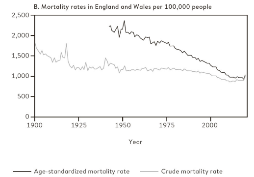

```{r setup, include=FALSE}
knitr::opts_chunk$set(echo = FALSE, warning = FALSE, message = FALSE)
```

```{r libs}
library(knitr)
library(kableExtra)
library(tidyverse)
library(DiagrammeR) # for PPDACC flowchart
library(eulerr) # for ploting statistics in context of science

```

```{=html}
<style>
.forceBreak { -webkit-column-break-after: always; break-after: column; }
</style>
```

## Statistika je když... {.flexbox .vcenter}

**Efektivita vakcíny Pfizer--BioNTech je 73 %.**

**11,5 % lidí v Česku žije v chudobě.**

::: {.notes}
**Efektivita vakcíny** je definována jako relativní pokles rizika. Tj. v očkované skupině je zasaženo o 73 % méně lidí, než by se nakazilo bez vakcíny. (Neznamená to, že 27 % z očkovaných bude zasaženo. Neznamená, že 73 % si utvoří protilátky.) Co se myslí pojmeme "zasaženo"? To může být různé. Klíčové se ptát, efektivita proti čemu: [V tomto případě](https://www.thelancet.com/journals/lancet/article/PIIS0140-6736(21)02183-8/fulltext) proti nakažení, dále 90 % efektivita proti hospitalizaci. Dále víme, že efektivita proti nákaze poklesla z 88 % po 1 měsíci na 47 % po 5 měsících. **Chudoba** je zde specifický ukazatel ohrožení chudobou a sociálním vyloučením, viz dále v prezentaci. Take-away: Než se začneme soustředit na samotná čísla, je potřeba si ujasnit, o čem se vlastně mluví.
:::

# Statistika a covid

## Základní reprodukční číslo {.flexbox .vcenter}

$$\Huge R_0$$

::: {.notes}
Základní reprodukční číslo = kolik lidí v průměru nakazí jeden nakažený v tzv. panenské populaci, tedy populaci bez imunity, která nedodržuje žádná opatření. Odhaduje se na cca 2 až 3 pro původní variantu covidu podle [článku v PLOS ONE](https://journals.plos.org/plosone/article?id=10.1371/journal.pone.0248731).
:::

## Základní představa pro $R_0 = 2$


<font size="2">[Zdroj obrázku Michigan Health Lab](https://images.app.goo.gl/qdgNZJQBKTSKWKhM8)</font>

## Blíže skutečnosti (pro $R_0 = 3$)

<div class="centered">
{width="40%"}
</div>

<font size="2">Převzato z @spiegelhalter2021</font>

## Odhad rozložení počtu nakažených

<div class="centered">
{width="45%"}
</div>

<font size="2">Převzato z @spiegelhalter2021</font>

::: {.notes}
"when introduced into susceptible communities, around 75% of people who catch the virus do not go on to infect anyone else, while a small minority (10%) lead to the great majority (80%) of new cases. There are several reasons for this. Some may be particularly infectious, while 'super-spreader' events can also occur. There was a choir practice in Washington State where one person with 'cold-like' symptoms led to 52 infections of 60 other singers."
:::

## Efektivní reprodukční číslo {.flexbox .vcenter}

$$\Huge R_t$$

::: {.notes}
Během pandemie odhadováno experty podle aktuálního vývoje počtu nakažených. Snaha dostat pod 1 = počet nakažených bude postupně klesat.
:::

# Statistika jako investigativní proces

## Statistika je...

... základ pro kvantitativní empirický výzkum, zaměřená na porozumění světu, vytváření vědění a opory v rozhodování. Aby tohle zvládla, nestačí chroustat čísla, je potřeba skutečně rozumět tomu, co znamenají.

## Statistika v kontextu vědy

```{r fig.align="center"}

set.seed(6)
fit2 <- euler(c("A" = 100, "B" = 0, "C" = 0,
                "A&B" = 80, "A&C" = 0, "B&C" = 0, "A&B&C" = 80))

plot(fit2, labels = c("Věda", "Empirický výzkum", "Statistika"),
     edges = list(lty = 1:3))

# image also saved as "01_stats_in_context.png"

# png("slides/figures/01_stats_in_context.png", width = 350, height = 350)
# plot(fit2, labels = c("Věda", "Empirický výzkum", "Statistika"),
#      edges = list(lty = 1:3))
# dev.off()


```

::: {.notes}
Empirický výzkum: Výzkum, kdy sebereme data z vnějšího světa a následně na základě těchto dat formujeme závěry o vnějším světě. Kvantitativní empirický výzkum se opírá o statistiku, ale jde stále o širší pojem než statistika. Zahrnuje v sobě také práci s koncepty a jejich operacionalizaci, vytváření měřících nástrojů (např. dotazníků), etiku výzkumu, designování výzkumných studií, principy práce s respondenty (motivace atp.) atp. Nejde jen o vytváření vědění z dat, ale o vytváření samotných dat.
:::

## PPDACC cyklus

```{r}

# 'Problém' -> 'Plán' ->
# 'Data' -> 'Analýza' ->
# 'Závěry\n(Conclusion)' ->
# 'Komunikace\n(Communication)' -> 'Problém'

diagram <- DiagrammeR::grViz("digraph {

graph [layout = circo, rankdir = LR]
node [shape = rectangle, style = filled, fillcolor = Lavender]

'Analýza' ->
'Závěry\n(Conclusion)' ->
'Komunikace\n(Communication)' ->
'Problém' ->
'Plán' ->
'Data' ->
'Analýza'

}")

diagram

```

PPDAC cyklus vymysleli @mackay2000a Explicitně na PPDACC ho rozšiřuje @spiegelhalter2019a

## Problém

-   Problém zpravidla definujeme skrze výzkumnou otázku.

>-   Objevila se nová infekce. Jak moc se šíří mezi lidmi?

>-   Vymyslete příklad relevantní výzkumné otázky pro sociologii.

::: {.notes}
Mění se v čase poměr sňatků a rozvodů? Hraje větší roli v příjmových nerovnostech seniorita, nebo formlní vzdělání? Způsobuje používání sociálních sítí depresi? Kdo páchá sebevraždy a proč? Má větší vliv na volbu politické strany pohlaví, věk, nebo vzdělání? Tisíce otázek...
:::

## Plán

-   Co měřit a jak? Jak data shromažďovat na jednom místě? Jaká relevantní data už existují? Jak se k nim dostat? Atd.

>-   Vytvořit datovou oporu: všechna relevantní pracoviště sdílejí informace o nových infekcích v přesně stanoveném formátu podle přesně stanovených definic.

## Data

-   Sběr dat, uchovávání, získání, čištění.
-   Reálná data jsou téměř vždy zatížena chybami a zkresleními - potřebujeme reflektovat a zaznamenat. Musíme co nejpřesněji rozumět tomu, co data znamenají, v čem se na ně můžeme spolehnout a v čem nikoliv.


>-   Jaké jsou vlastnosti testů, které ověřují, že je někdo nakažený? Může záležet na typu testu, jeho administraci atp. Zajímá nás míra falešné pozitivity a falešné negativity. Navíc zpočátku třeba testy nebyly k dispozici a diagnóza probíhala na základě odborného posouzení bez nich. 

>-   S postupem času je potřeba zaznamenávat nové typy dat, například reinfekce. Nebo jestli byl infikovaný člověk očkovaný. 

## Analýza

-   Zpracovávání dat v softwaru, tabulky, grafy, testování hypotéz,...

<div class="centered">
{width="55%"}
</div>

<font size="2">[Zdroj Seznam zprávy](https://www.seznamzpravy.cz/clanek/pocet-nakazenych-cr-koronavirus-120166)</font>

::: {.notes}
Když se řekne statistika, hodně lidí si představí právě jen tuto její část. Ale taková předtava nedoceňuje skutečnou šíři aplikovaného statistického bádání. 
:::

## Závěry/Komunikace

<blockquote>

Čísla nemají možnost mluvit sama za sebe. My mluvíme za ně. My jim dáváme smysl.

---Nate Silver, Signál a šum [-@silver2015]

</blockquote>

-   Intepretace, generování nových nápadů, komunikace různým skupinám.

## Závěry/Komunikace - ilustrace 1 {.columns-2}

<div class="centered">
{width="95%"}
</div>

<p class="forceBreak">

</p>

<div class="centered">
{width="95%"}
</div>


## Závěry/Komunikace - ilustrace 2

<div class="centered">

</div>

<font size="2">Obrázek z @spiegelhalter2021 s odvoláním na ONS, končí rokem 2020.</font>

::: {.notes}
Statistika je nástroj, ale význam světu dáváme my, záleží na našich hodnotách, preferencích, sociálním kontextu atp. Spiegelhalter in [Covid by Numbers](https://www.amazon.com/Covid-Numbers-Making-Pandemic-Pelican-ebook/dp/B0948Q12PJ): Data pro Británii: míra úmrtí na 100 000 obyvatel nebyla v covidovém roce 2020 horší než v roce 2000 (při započtení vlivu věkové struktury). Lidé za časů covidu tedy měli větší šanci se dožít příštích narozenin než lidé v roce 2000 nebo kdykoliv předtím. Znamená to, že covid nebyl tak zlý? Stejně tak ale platí, že od chřipkové epidemii v roce 1951 v Británii nikdy nedošlo k většímu meziročnímu nárůstu míry úmrtnosti. Záleží na interpretaci.
:::

## PPDACC cyklus - shrnutí

```{r}

# 'Problém' -> 'Plán' ->
# 'Data' -> 'Analýza' ->
# 'Závěry\n(Conclusion)' ->
# 'Komunikace\n(Communication)' -> 'Problém'

diagram <- DiagrammeR::grViz("digraph {

graph [layout = circo, rankdir = LR]
node [shape = rectangle, style = filled, fillcolor = Lavender]

'Analýza' ->
'Závěry\n(Conclusion)' ->
'Komunikace\n(Communication)' ->
'Problém' ->
'Plán' ->
'Data' ->
'Analýza'

}")

diagram

```

# Studium statistiky na Katedře sociologie FF UK

## Statistika a empirický výzkum u nás {.columns-2 .smaller}

### Statistika

-   Statistika 1 + 2 (Bc.)
-   Zpracování scg. dat (Bc.)
-   Analýza dat v SPSS 1 + 2 (Mgr.)
-   Úvod do vícerozměrné an. dat (Mgr.)
-   Pokročilé stat. met. (Mgr.)
-   Volitelné kurzy (hlavně v R)

### Empirický výzkum

-   Scg. výzkum 1, 2, 3, 4 (Bc.)

<p class="forceBreak">

</p>


# Statistika je proces, ale má různé cíle...

## Zmatení pojmů: cíle vědy a cíle statistiky {.columns-2 .smaller}

### Cíle vědy (hierarchie)

-   Deskripce - popis světa a jeho pravidelností
-   Vysvětlení (explanace) - kauzální mechanismus, kauzální inference (umožňuje predikci a kontrafaktuální uvažování, tj. kreativitu)

Rozdíl mezi deskripcí a explanací ilustruje rozdíl mezi fakty a teorií.

<p class="forceBreak">

</p>

### Cíle statistiky

-   Deskripce dat (deskriptivní statistika)
-   Inference z dat (vzorku) na populaci (inferenční, resp. induktivní statistika)

Z hlediska cílů vědy plní deskriptivní statistika a induktivní statistika stejnou funkci: deskripci. Vysvětlení nikdy nevychází jen ze statistiky, vždy potřebuje teorii.


::: {.notes}
Nadstava: O hierarchii cílů vědy lze polemizovat. Někdy rozlišujeme deskripci (prostý popis), predikci (odhad budoucího chování) a explanaci (vysvětlení kauzálních mechanismů, které pozorované jevy způsobují). Tehdy je predikce chápána agnosticky z hlediska toho, jak probíhá kauzalita (například prediktivní algoritmy strojového učení, které vychází čistě z asociací). Zde pro jednoduchost predikce uvedena jako jedna z funkcí explanace. 
:::


## Teorie a fakta (data) {.columns-2 .smaller}

"Některé druhy gazel, když spatří predátora, vyskakují do výšky."

"Chování gazel vysvětluje tzv. signalizační teorie, podle které predátorovi ukazuje, že má spoustu energie a bude obtížné ji chytit (vyhne se tím výdeji při nutnosti útěku)."

<p class="forceBreak">

</p>

{width="80%"}

<font size="2">Autor foto: [Yathin sk - I photographed this springbok in Etosha National Park](https://commons.wikimedia.org/w/index.php?curid=21251829), CC BY-SA 3.0</font>

::: {.notes}
Signalizační teorie našla své místo i ve společenských vědách -- například existuje signalizační teorie o náboženství: náboženství jako nástroj udržování skupinové soudržnosti a spolupráce (evoluce na úrovni skupin). Nákladné náboženské signalizační rituály (obřízka, půst atp.) mají podle této teorie zabránit „černým pasažérům" (lidem, kteří to s loajalitou skupině nemyslí vážně).Tendence k signalizačnímu chování také vysvětluje okázalou spotřebu (ukazuji zdroje tím, že jimi mrhám).
:::

# Proměnná: základní stavební kámen statistického uvažování

A variable

## Proměnná

Proměnná: formální reprezentace určité vlastnosti či charakteristiky entit (věcí, osob, ...).

Statistika: zkoumání vlastností proměnných a vztahů mezi nimi.

## Příklad standardního zápisu proměnných v sociologii

```{r}
tab <- tribble(~"ID", ~"pohlaví", ~"věk", ~"postoj k placení školného",
        1,"žena",22,"rozhodně souhlasí",
        2,"žena",48, "spíše nesouhlasí",
        3,"muž",35, "neví/nechce odpovědět")

kbl(tab) %>%
   kable_material(bootstrap_options = c("hover", "condensed"))
```


::: {.notes}
Většina kurzu bude o tom, jak smysluplně takové a větší tabulky překlápět do vědění. Než se začneme dívat do dat, je ale rozumné přemýšlet o datech.  
:::


## Vidět svět jako data

Prvním krokem statistického vyšetřování je překlopit svět na data.

>-   Kolik stromů je na světě?
>-   Jaká je úmrtnost novorozenců?

::: {.notes}
Stromy: oficiální def. (může se lišit podle země): rostlina s dřevnatým kmenem s obvodem ve výši prsou (DBH) 10 cm. Počítání na vzorku oblastí, odhad celé Země dle satelitních snímků. Res: cca 3\^12 stromů. Zdroj: Spiegelhalter, The Art of Statistics.

Británie: odlišnosti v míře úmrtnosti novorozenců mezi London a Midlands. ALE: Ne rozdíl v péči, ale v tom, jak zaznamenávali případy dětí narozených těsně před 24. týdnem (poté zákon jasně říká narození, ne miscarriage). V Midlands jako narození, v Londýně miscarriage. Jak doktoři v zemi začali adaptovat přístup v Midlands, začali i národní statistiky ukazovat zhoršující trendy. Falešný poplach ['Obesity, poverty, smoking and a shortage of midwives could all be factors, say health professionals'](https://www.theguardian.com/society/2018/mar/15/concern-at-rising-infant-mortality-rate-in-england-and-wales)
:::

## Aplikovaná statistika potřebuje definice pojmů

<blockquote>

Představte si, že se díváte na dvě ovce na poli. Kolik ovcí tam je? Dvě, samozřejmě. Až na to, že jedna z ovcí není ovce, je to jehně. A ta druhá ovce je těžce březí -- vlastně rodí, každou chvíli porodí. Kolik že to bylo ovcí? Jedna? Dvě? Dvě a půl?

---[Tim Harford, How to make the World add up](https://www.amazon.sg/How-Make-World-Add-Differently/dp/1408712245)

</blockquote>

Tim Harford: "Avoid premature enumeration"

::: {.notes}
Tim Harford: Over the years, as I found myself trying to lead people out of statistical mazes week after week, I came to realise that many of the problems I encountered were because people had taken a wrong turn right at the start. They had dived into the mathematics of a statistical claim -- asking about sampling errors and margins of error, debating if the number is rising or falling, believing, doubting, analysing, dissecting -- without taking the time to understand the first and most obvious fact: what is being measured, or counted? What definition is being used?
:::

## Sociologický příklad: Ohrožení chudobou

Otázka: Máme v ČR ve srovnání se zbytkem EU hodně, nebo málo lidí ohrožených chudobou?

## Ohrožení chudobou: data

<div class="centered">
{width="70%"}
</div>

<font size="2">[Zdroj Eurostat](https://ec.europa.eu/eurostat/web/products-eurostat-news/-/edn-20211015-1#:~:text=In%202020%2C%20there%20were%2096.5,data%20published%20by%20Eurostat%20today.)</font>

>-   Jak byste nízkou míru ohrožení chudobou u nás vysvětlili?

## Co je ohrožení chudobou a sociálním vyloučením?

<blockquote>

At risk of poverty or social exclusion, abbreviated as AROPE, corresponds to the sum of persons who are either at risk of poverty, or severely materially and socially deprived or living in a household with a very low work intensity.

<font size="3">[Eurostat](https://ec.europa.eu/eurostat/statistics-explained/index.php?title=Glossary:At_risk_of_poverty_or_social_exclusion_(AROPE))</font>

</blockquote>

>-   Ale co to znamená?

::: {.notes}
**At risk of poverty rate** = share of people with an equivalised disposable income (after social transfer) below the at-risk-of-poverty threshold, which is set at 60 % of the national median equivalised disposable income after social transfers. **Severe material deprivation rate** = cannot afford at least 4 out of 9 predefined material items considered by most people to be desirable or even necessary to lead an adequate life. **Low work intensity indicator** = households where the adults (those aged 18-59, but excluding students aged 18-24) worked a working time equal or less than 20 % of their total combined work-time potential during the previous year.
:::

## Psychologický příklad: Násilné videohry

Otázka: Způsobuje hraní násilných počítačových her násilné chování u dětí?

::: {.notes}
Lze měřit korelace, ale ty neimplikují kauzalitu. Experimentálně se ale zase neměří násilné chování, ale "agresivní chování". [Vlivná studie](https://doi.org/10.1037/a0024908) například měřila agresivní chování tím, nakolik pálivý drink připraví účastník domnělému jinému účastníkovi, o kterém ví, že nemá rád pálivé jídlo. Je to vypovídající vzhledem k násilnému chování? (Res: pálivost drinku neovlivnilo, jestli byla hra násilná, ale jestli byla kompetitivní)
:::

## Operacionalizace

Překlopení pojmů z jazyka teorie do observačního jazyka.

::: {.notes}
Všichni máme nějakou intuitivní představu, co je to chudoba. Ale jak objektivně, standardizovaně a počitatelně pozorovat chudobu? Pozorovat namísto toho příjem a jeho překročení nebo nepřekročení 60% hranice mediánu je praktičtější.
:::

<!-- ## Chcete se dozvědět víc? -->

<!-- Projekt [STATS](https://senseaboutscienceusa.org/) usiluje o podporu statistické gramotnosti v USA, především se zaměřuje na novináře. Je to sice jiný kontext, ale inspirativní, například [průvodce statistikami ve vzdělávání](https://senseaboutscienceusa.org/a-reporters-guide-to-education-statistics/). -->

## Reference v prezentaci {.smaller}

Následuje seznam referencí, které v prezentaci neměly aktivní proklik na zdroj.
