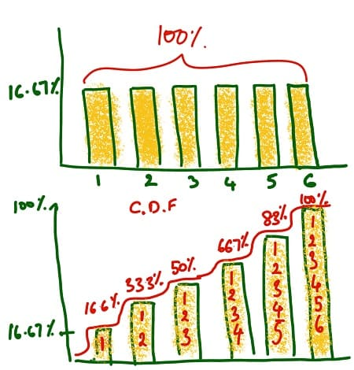
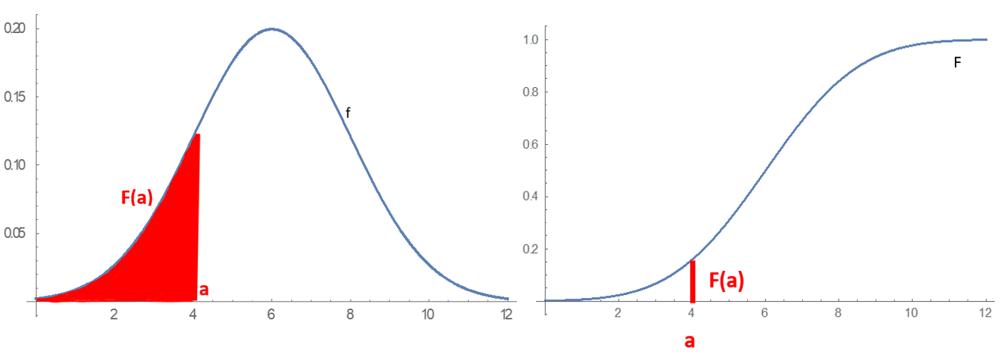
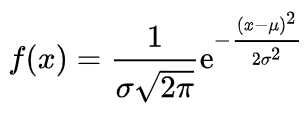
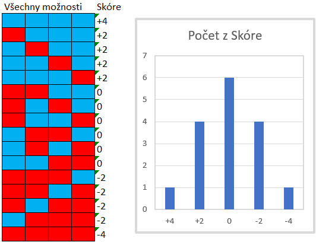
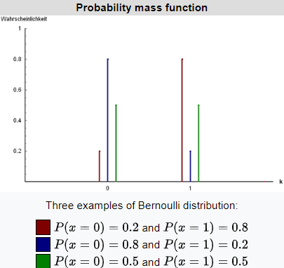

```{r setup, include=FALSE}
knitr::opts_chunk$set(echo = FALSE, warning = FALSE, message = FALSE)
```

```{r libs}
library(tidyverse)
```

```{=html}
<style>
.forceBreak { -webkit-column-break-after: always; break-after: column; }
</style>
```

## Proč ve statistice potřebujeme pravděpodobnost?

Klasická inferenční statistika funguje asi takto:

* udělám předpoklad o světě (vytvořím model světa)
* seberu data
* ptám se, jak překvapivá jsou tato data za předpokladu modelu
* pokud jsou velmi překvapivá (nepravděpodobná) odmítnu původní model


Teorie pravděpodobnosti nás učí formálně vyhodnocovat (ne)překvapivost pozorovaných dat.

## Motivační příklad

Existuje rozdíl ve výšce žen a mužů?

Model světa: neexistuje

Seberu data:

- ženy: 166, 175, 164, 171
- muži: 180, 172, 175, 186


Jaká je pravděpodobnost, že bychom dostali takto nebo více extrémní rozdíl mezi výškou žen a mužů, pokud by skutečný rozdíl v populaci byl 0?

## Motivační příklad - rozuzlení

Data:

- ženy: 166, 175, 164, 171
- muži: 180, 172, 175, 186

Pravděpodobnost (za určitých předpokladů):

```{r}
z <- c(166, 175, 164, 171)
m <- c(180, 172, 175, 186)
t <- t.test(z,m)
round(t$p.value, 3)
```

# Axiomy teorie pravděpodobnosti

## Axiomy teorie pravděpodobnosti

1) $Pr(z) >= 0$, kde z značí nějakou událost
1) $Pr(sample space) = 1$  
1) Pokud $z_i$, ..., $z_k$ jsou vzájemně se vylučující jevy: $Pr(z_i \cup ... \cup z_k) = Pr(z_i) + ... + Pr(z_k)$


Z těchto axiomů lze odvodit další užitečná pravidla, například:

>- Pravidlo doplňku: $Pr(z) = 1 - Pr(!z)$, kde vykřičník značí negaci
>- Mlutiplikační pravidlo: Pravděpodobnost, že najednou nastanou vzájemně nezávislé jevy, se rovná součinu jejich individuálních pravděpodobností

::: {.notes}
**Sample space** = všechny možné události/jevy, které mohou nastat. Například pro hod šestistěnnou kostkou je sample space vektor 1,2,3,4,5,6. **Axiom** není předpoklad ve smyslu, že bychom mohli rozhodnout, zda je špatně nebo správně. Axiom je prvotní princip, který přijímáme jako platný a nezpochybňujeme jeho pravdivost, případně zpochybňujeme jeho užitečnost. Například druhý axiom bychom snadno mohli změnit na $Pr(sample space)$ = 2. Hodnota pravděpodobnoti 1 by pak značila ne 100% pravděpodobnost, ale 50%. **Příklad multiplakčního pravidla:** pravděpodobnost, že mi na kostce padne číslo 6 a zároveň na minci orel, je $1/6*1/2 = 1/12$.
:::

## Dva přístupy k pravděpodobnosti

* Analytický přístup
* Simulační přístup

::: {.notes}
**Analytický přístup** = skrze teorii: z axiomů odvozujeme složitější zákonitosti pro různé pravděpodobnostní distribuce. Viz obor statistika a teorie pravděpodobnosti. **Simulační přístup** = díky výpočetní technice prostě simulujeme určité pokusy mnohotisíckrát a pak se jen podíváme na výsledek. Například bootstrapping v minulé přednášce.  
:::

# Funkce rozdělení pravděpodobnosti (Probability distribution functions)

## Funkce rozdělení pravděpodobnosti (Probability distribution functions)

Jsou dvě:

* Hustota pravděpodobnosti (probability density function, PDF)
* Kumulativní distribuce (cumulative distribution function, CDF)


::: {.centered}
{width=25%}
:::

<font size="2">[Zdroj graduatetutor.com](https://www.graduatetutor.com/statistics-tutor/probability-density-function-pdf-and-cumulative-distribution-function-cdf/)</font>

## Hustota pravděpodobnosti (probability density function, PDF)

Značení ... budeme rozlišovat Pr ve smyslu pravděpodobnost, že proměnná bude nabývat určité hodnoty, a P ve smyslu funkce hustoty pravděpodobnosti pro celé spektrum možných hodnot proměnné.

$P(y)$ ... funkce hustoty pravděpodobnosti proměnné y

$Pr(y=4)$ ... pravděpodobnost, že na kostce padne 4


## Počítání pravděpodobnosti na základě PDF

* Hod kostkou, $Pr(y = 3)$?
* Hod kostkou, $Pr(y != 3)$?
* Hod kostkou, $Pr(y >= 3)$?
* Dva hody kostkou, $Pr(y_1 >= 3 \;\&\; y_2 = 6)$?


# Vybraná užitečná rozdělení pravděpodobnosti (užitečné modely světa)

## Ideální rozdělení č. 1: Rovnoměrné (uniformní)

* Všechny hodnoty mají stejnou pravděpodobnost výskytu
* Hod kostkou, tahání karty z balíčku, tahání tomboly ... možná datum narození?


::: {.notes}
Datum narození závisí na datu početí. Je toto náhodné, nebo "zakládají" lidé na dítě v různých částech roku různě? Model: je rovnoměrné. Porovnáme s realitou: je realita v souladu s modelem?
:::


## Pravděpodobnost diskrétních a spojitých proměnných {.columns-2 .smaller} 
 
* Pro diskrétní proměnné: PDF: 

$$\sum_{for\;all\;y} P(y) = 1$$


* Pro diskrétní proměnné: PDF: 

$$ \int_{-\infty}^{+\infty} f(y) \, dy = 1$$

<p class="forceBreak">

</p>

```{r , echo=FALSE,out.width="49%", out.height="20%",fig.cap="Diskrétní rovnoměrné",fig.show='hold',fig.align='center'}

knitr::include_graphics(c("figures/08_uniform_discrete_pdf.png","figures/08_uniform_discrete_cdf.png"))

```

```{r , echo=FALSE,out.width="49%", out.height="20%",fig.cap="Spojité rovnoměrné",fig.show='hold',fig.align='center'}

knitr::include_graphics(c("figures/08_uniform_continuous_pdf.png","figures/08_uniform_continuous_cdf.png"))

```


<font size="2">[Zdroj obrázků spojité](https://en.wikipedia.org/wiki/Continuous_uniform_distribution) a [Zdroj obrázků diskrétní](https://en.wikipedia.org/wiki/Discrete_uniform_distribution)</font>

::: {.notes}
Pro diskrétní proměnné je to jednoduché, jen posčítáme pravděpodobnosti všech možných jevů. Aby to byla PDF, musí být součet 1. Pozor, někdy se PDF pro diskrétní proměnné označuje jako "probability mass function", tedy PMF. *Integrál* -  plocha pod křivkou. PDF pro spojitou proměnnou má tedy tu vlastnost, že plocha pod její křivkou se musí rovna 1. 
:::


## Diskrétní rovnoměrné rozdělení - průměr a rozptyl {.columns-2 .smaller}

-   a ... minimum
-   b ... maximum
-   n ... počet možných hodnot

$$
Průměr = (a+b)/2
$$

$$
Rozptyl = (n^2 - 1)/12
$$


<p class="forceBreak">

</p>


```{r , echo=FALSE,out.width="65%", out.height="20%",fig.cap="Diskrétní rovnoměrné",fig.show='hold',fig.align='center'}

knitr::include_graphics(c("figures/08_uniform_discrete_pdf.png","figures/08_uniform_discrete_cdf.png"))

```


::: {.notes}
U teoretických distribucí mohou existovat vzorce pro výpočet průměru, rozptylu a dalších statistik ze základních parametrů distribuce. Fungují ale samozřejmě i obecné vzorce, které jsme si ukazovali.
:::


## Spojité rovnoměrné rozdělení - průměr a rozptyl, nadstavba {.columns-2 .smaller}

-   a ... minimum
-   b ... maximum

$$
Průměr = (a+b)/2
$$

$$
Rozptyl = (b - a)^2/12
$$


<p class="forceBreak">

</p>


```{r , echo=FALSE,out.width="65%", out.height="20%",fig.cap="Diskrétní rovnoměrné",fig.show='hold',fig.align='center'}

knitr::include_graphics(c("figures/08_uniform_continuous_pdf.png","figures/08_uniform_continuous_cdf.png"))

```


## Ideální rozdělení č. 2: Normální (Gaussovo)

* Tzv. zvonová křivka
* Střední a prostřední hodnoty jsou časté. Čím extrémnější hodnoty, tím méně časté
* Je na obrázku PDF, nebo CDF?

```{r fig.height=3}
p1 <- ggplot(data = data.frame(x = c(-3, 3)), aes(x)) +
  stat_function(fun = dnorm, n = 101, args = list(mean = 0, sd = 1)) + ylab("") +
  scale_y_continuous(breaks = NULL)
p1
```


## Normální rozdělení: PDF a CDF

::: {.centered}
{width=60%}
:::

<font size="2">[Zdroj Wikipedie](https://en.wikipedia.org/wiki/Probability_distribution)</font>


* Všimněte si: čím vyšší je PDF, tím strmější je CDF (obecná vlastnost funkcí rozdělení pravděpodobnosti, nejen pro normální rozdělení)


## Normální rozdělení - formální definice PDF (nadstavba)

::: {.centered}

:::

Vypadá to děsivě, ale pí a eulerovo číslo jsou konstanty, x zastuje hodnoty proměnné, takže jediné, co vám stačí, je $\mu$ a $\sigma$, tedy průměr a směrodatná odchylka.

Jinými slovy: normální rozdělení je plně efinováno dvěma parametry: průměrem a směrodatnou odchylkou.


## Standardní normální rozdělení a jeho vlastnosti

::: {.centered}
{width="65%"}
:::

<font size="2">Zdroj [Wikipedia](https://en.wikipedia.org/wiki/Normal_distribution)</font>

Pravidlo tří sigma (68-95-99,7)


## Různá normální rozdělení {.smaller}

::: {.centered}
{width=55%}
:::

<font size="2">[Převzato z Wikipedie](https://cs.wikipedia.org/wiki/Norm%C3%A1ln%C3%AD_rozd%C4%9Blen%C3%AD#:~:text=Norm%C3%A1ln%C3%AD%20rozd%C4%9Blen%C3%AD%20neboli%20Gaussovo%20rozd%C4%9Blen%C3%AD,%2C%20p%C5%99edpisem%20nebo%20modelem%E2%80%9C.))</font>

>- Mezi jaké hodnoty spadá prostředních 68 % červeného rozdělení?
>- Kolik procent pozorování červeného rozdělení spadá mezi hodnoty -2 a 1?
>- Kolik procent pozorování červeného rozdělení spadá mezi hodnoty -3 a 0?


## Jak vzniká normální rozdělení? Vytvoření intuice

Typicky v důsledku mnoha malých vlivů. Působení těchto vlivů se častěji "vykrátí" (některé přidávají, jiné ubírají).

::: {.centered}

:::

::: {.notes}
V hypotetickém příkladu ovlivňují výsledek jen čtyři faktory. Ty mohou každý nabývat polohy +1 (modrá), nebo -1 (červená). Je vidět, že možné výsledky dávají vzniknout normálnímu rozdělení.
:::

## Alternativní (Bernoulliho) rozdělení {.columns-2 .smaller}

* Rozdělení náhodné proměnné, která může nabývat pouze 1, nebo 0
* Pr(y=1) značíme $p$
* Pr(y=0) značíme $1-p$ nebo $q$
* $m = p$
* $var = p*q$


Kontrolní otázky: 

* Kolik vstupních údajů plně definuje alternativní rozdělení?
* Jak by vypadala funkce hustoty spojitého alternativního rozdělení?

<p class="forceBreak">

</p>



<font size="2">Zdroj [Wikipedia](https://en.wikipedia.org/wiki/Bernoulli_distribution)</font>


::: {.notes}
Alternativní rozdělení je logicky definováno jen pro diskrétní proměnné. 
:::

## Binomické rozdělení (také Bernoulliho schéma) {.columns-2 .smaller}

* Popisuje výskyt jevu v $n$ nezávislých pokusech, z nichž každý má stejnou pravděpodobnost úspěchu
* Plně definováno dvěma údaji: 
    * $n$, počet pokusů
    * $p$, pravděpodobnost úspěchu
* $m=np$
* $var=npq$
    
<p class="forceBreak">

</p>


```{r , echo=FALSE,out.width="65%", out.height="20%",fig.show='hold',fig.align='center'}

knitr::include_graphics(c("figures/08_binomial_pdf.png","figures/08_binomial_cdf.png"))

```

<font size="2">Zdroj [Wikipedia](https://en.wikipedia.org/wiki/Binomial_distribution#Bernoulli_distribution)</font>


## Počítání s binomickým rozdělením {.smaller}

```{r fig.height=3}
data.frame(heads = 0:10, prob = dbinom(x = 0:10, size = 10, prob = 0.5)) %>%
ggplot(aes(x = factor(heads), y = prob)) +
  geom_col() +
  geom_text(
    aes(label = round(prob,2), y = prob + 0.01),
    position = position_dodge(0.9),
    size = 3,
    vjust = 0
  ) +
  labs(title = "Pr(X), kde X ... počet orlů na minci",
       subtitle = "binomické rozdělení (10 hodů spravedlivou mincí)",
       x = "Počet orlů (X)",
       y = "Pravděpodobnost") 
```

$$
P(k) = P(X = k) = {n \choose k} p^k(1-p)^{n-k} 
$$

kde:

$$
{n \choose k} = \frac{n!}{k!(n-k)!}
$$


## Příklad: Přechod na trvalou hybridní výuku? {.smaller}

* X ... proměnná, zda příznivec hybridní výuky (1), nebo ne (0)
* Pr(X=příznivec) = $p_X$
* Počet náhodně vybraných respondentů n = 10
* Y ... počet příznivců v našem vzorku (teoreticky od 0 do 10)

Otázky:

>- Jaké rozdělení má proměnná X? Co proměnná Y?
>- Pr(Y=0), když $p_X$ = 0.2
>- Pr(Y=1), když $p_X$ = 0.2
>- Pr(Y>=2), když $p_X$ = 0.2
>- E(Y)?, když $p_X$ = 0.2
>- E(Y)?, když $p_X$ = 0.5
>- Var(Y)?, když $p_X$ = 0.4
>- Které stavy byste označili za běžné a které za extrémní?
>- Pokud byste předpokládali $p_X$ = 0.2, je 8 příznivců hybridní výuku extrémní stav, který by zpochybnil Vás předpoklad?
>- Jak se výsledky změní, pokud n = 1000? Jak se změní tvar rozdělení?


::: {.notes}
**1** X - Alternativní čili Bernoulliho rozdělení, Y - binomické. **2** $0.8^10 = 0.107$. **3** Pozor, toto není $0.2^2 * 0.8^8$, protože 2 z 8 lze vybrat mnoha způsoby. Je potřeba použít kombinatoriku, resp. vzorec výše. **4** Nejlepší je spočítat Pr(Y=0) a Pr(Y=1) a jejich součet odečíst od 1.  
:::

## Změna tvaru binomického rozdělení při růstu $n$

```{r}

par(mfrow = c(2, 3))

n <- 5
k <- seq(0, n, 1)
plot (k, dbinom(k, n, 0.2), type = "l", ylab = "density",
      main = "n=5, p=0.2")

n <- 10
k <- seq(0, n, 1)
plot (k, dbinom(k, n, 0.2), type = "l", ylab = "density",
      main = "n=10, p=0.2")

n <- 20
k <- seq(0, n, 1)
plot (k, dbinom(k, n, 0.2), type = "l", ylab = "density",
      main = "n=20, p=0.2")

n <- 50
k <- seq(0, n, 1)
plot (k, dbinom(k, n, 0.2), type = "l", ylab = "density",
      main = "n=50, p=0.2")

n <- 100
k <- seq(0, n, 1)
plot (k, dbinom(k, n, 0.2), type = "l", ylab = "density",
      main = "n=100, p=0.2")


n <- 1000
k <- seq(0, n, 1)
plot (k, dbinom(k, n, 0.2), type = "l", ylab = "density",
      main = "n=1000, p=0.2")


par(mfrow = c(1, 1))

```


## Vyčíslení pravděpodobností v softwaru

Pravděpodobnost, že z 10 hodů mincí padne 4 nebo 5 orlů.

```{r echo=TRUE}
sum(dbinom(4:5, 10, 0.5))
```

Zkuste si doma ověřit výsledky pomocí funkce binom.dist v MS Excel. 


# Proč se vůbec věnujeme teorii pravděpodobnosti?

## Proč ke statistice potřebujeme pravdědpodobnost?

Statistika nám pomáhá určit, jak (ne)pravděpodobná jsou určitá data za předpokladu určitého modelu. 

