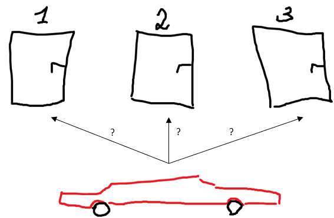
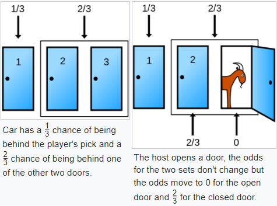
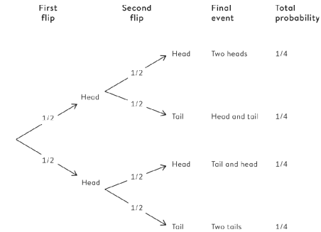
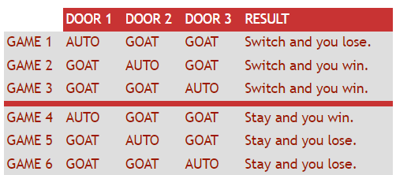

```{r setup, include=FALSE}
knitr::opts_chunk$set(echo = FALSE, warning = FALSE, message = FALSE)
```

```{r libs}
library(tidyverse)
```

```{=html}
<style>
.forceBreak { -webkit-column-break-after: always; break-after: column; }
</style>
```

# Proč nezačínáme tento kurz teorií pravděpodobnosti?

## Dva hody mincí: jaká je pravděpodobnost, že padne dvakrát panna?

Zamyslete se a odpověď napište na kus papíru.

> -   Zmýlili jste se? [To se stalo i 60 % britských poslanců.](https://www.theguardian.com/lifeandstyle/2016/apr/24/heads-or-tails-smarter-than-an-mp-personality-quiz-ben-ambridge)

## Monty Hall

::: {.centered}
{width="75%"}
:::

::: {.notes}
Monty Hall -- moderoval televizní show.
Soutěžící si vybral dveře, věděl, že za jednimi je auto, za dvěma jen koza.
Moderátor ze zbývajících dvou otevřel jedny, za kterými byla koza.
Soutěžící měl možnost zůstat při své volbě, nebo změnit volbu a vybrat si zbývající neotevřené dveře.
:::

## Marilyn vos Savant, nejvyšší IQ dle Guinnessovy knihy rekordů {.smaller}

Marilyn: Účastník by měl svoji volbu změnit.

<font size="5">

<blockquote>

I have been a faithful reader of your column, and I have not, until now, had any reason to doubt you.
However, in this matter (for which I do have expertise), your answer is clearly at odds with the truth.
James Rauff, Ph.D. Millikin University

</blockquote>

<blockquote>

May I suggest that you obtain and refer to a standard textbook on probability before you try to answer a question of this type again?
Charles Reid, Ph.D. University of Florida

</blockquote>

<blockquote>

You made a mistake, but look at the positive side.
If all those Ph.D.'s were wrong, the country would be in some very serious trouble.
Everett Harman, Ph.D. U.S. Army Research Institute

</blockquote>

</font>

::: {.notes}
Odpověď Marylin: Není to 1:1, protože musíme uvažovat předchozí pravděpodobnost -- ta byla pro 2.
a 3.
dveře dohromady celkem 2/3.
Vodítko pro intuici: 100 dveří, moderátor otevře 98 z 99 nevybraných.
[Jedno z nejlepších vláken historie internetu je k přečtení zde.](https://web.archive.org/web/20130121183432/http://marilynvossavant.com/game-show-problem/)
:::

## Monty Hall vizuálně



<font size="2">[Zdroj Wikipedie](https://en.wikipedia.org/wiki/Monty_Hall_problem)</font>

## Proč nezačínáme tento kurz teorií pravděpodobnosti?

Pravděpodobnost je těžká a neintuitivní disciplína, začínat s ní nesplňuje Komenského zásadu posupovat od jednoduchého ke složitému.

## Očekávaná četnost jako nástroj řešení pravděpodobnostních úloh



<font size="2">Převzato z [@spiegelhalter2019]</font>

## Monty Hall výčtem možností (očekávaná četnost)



<font size="2">[Zdroj Ask Marilyn](https://web.archive.org/web/20130121183432/http://marilynvossavant.com/game-show-problem/)</font>


# Axiomy teorie pravděpodobnosti

## Axiomy teorie pravděpodobnosti

1) $Pr(z) >= 0$, kde z značí nějakou událost
1) $Pr(sample space) = 1$  
1) Pokud $z_i$, ..., $z_k$ jsou vzájemně se vylučující jevy: $Pr(z_i \cup ... \cup z_k) = Pr(z_i) + ... + Pr(z_k)$


Z těchto axiomů lze odvodit další užitečná pravidla, především:

>- Pravidlo doplňku: $Pr(z) = 1 - Pr(!z)$, kde vykřičník značí negaci
>- Mlutiplikační pravidlo: Pravděpodobnost, že najednou nastanou vzájemně nezávislé jevy, se rovná součinu jejich individuálních pravděpodobností

::: {.notes}
*Sample space* = všechny možné události/jevy, které mohou nastat. Například pro hod šestistěnnou kostkou je sample space vektor 1,2,3,4,5,6. **Axiom** není předpoklad ve smyslu, že bychom mohli rozhodnout, zda je špatně nebo správně. Axiom je prvotní princip, který přijímáme jako platný a nezpochybňujeme jeho pravdivost, případně zpochybňujeme jeho užitečnost. Například druý axiom bychom snadno mohli změnit na $Pr(sample space)$ = 2. Hodnota pravděpodobnoti 1 by pak značila ne 100% pravděpodobnot, ale 50%. 
:::

## Dva přístupy k pravděpodobnosti

* Analytický přístup
* Simulační přístup

## Hustota pravděpodobnosti (probability density function, PDF)

$P(y)$ ... rozlišuji Pr ve smyslu pravděpodobnost, že proměnná bude nabývat určité hodnoty, a P ve smyslu funkce hustoty pravděpodobnosti pro celé spektrum možných hodnot proměnné

TBD: obrázek PDF, diskrétní i spojitý, ideálně více typů rozdělení, např. normál a poisson

## Pravděpodobnost diskrétních a spojitých proměnných

* Pro diskrétní proměnné: PDF: $\sum_{všech\;y} P(y) = 1$
* Pro diskrétní proměnné: PDF: $ \int^{+\infty}_{-\infty} f(y)\, dy = 1 $


::: {.notes}
Pro diskrétní proměnné je to jednoduché, jen posčítáme pravděpodobnosti všech možných jevů. Aby to byla PDF, musí být součet 1. *Integrál* -  plocha pod křivkou. PDF pro spojitou proměnnou má tedy tu vlastnost, že plocha pod její křivkou se musí rovna 1.
:::

## Počítání pravděpodobnosti na základě PDF

TBD: ukázat ploch pod křivkou pro daný rozsah (od bodu do bodu) a nějaké značení, jak se to popisuje

## Návrat rovnoměrného rozdělení

TBD - představit pomocí jazyka prsti

## Návrat normálního rozdělení

TBD - ...

## Bernoulliho rozdělení

TBD

## Binomické rozdělení

TBD

## CDF

TBD


## Podmíněná pravděpodobnost

TBD - tato přednáška, nebo jinde?

# Odlišné filosofie pravděpodobnosti

## Co je to pravděpodobnost?

TBD


# Proč se vůbec věnujeme teorii pravděpodobnosti?

## Proč ke statistice potřebujeme pravdědpodobnost?

## 

<!---

## Diskrétní rovnoměrné rozdělení - průměr a rozptyl (nadstavba)

-   a ... minimum
-   b ... maximum
-   n ... počet možných hodnot

$$
Průměr = (a+b)/2
$$

$$
Rozptyl = (n^2 - 1)/12
$$

::: {.notes}
U teoretických distribucí mohou existovat vzorce pro výpočet průměru, rozptylu a dalších statistik ze základních parametrů distribuce. Fungují ale samozřejmě i obecné vzorce, které jsme si ukazovali. Nemusíte se tyto vzorce učit. Spíš jen abyste nebyly překvapeni, když se s něčím takovým setkáte.
:::


## Rovnoměrné (uniformní) rozdělení

-   Všechny hodnoty jsou stejně zastoupené

```{r}

tibble(value = as_factor(1:6),
       prob = 1/6) %>% 
  ggplot(aes(x = value, y = prob)) + 
  geom_col() + 
  labs(x = "Hodnota na kostce", y = "Pravděpodobnost dané hodnoty", title = "Diskrétní uniformní rozdělení - hod kostkou") +
  scale_y_continuous(labels = scales::label_percent())
  

```

::: {.notes}
Pozor, existuje rozdíl mezi diskrétním a spojitým rozdělením. Tomu se budeme více věnovat v příští přednášce o pravděpodobnosti.
:::


-->