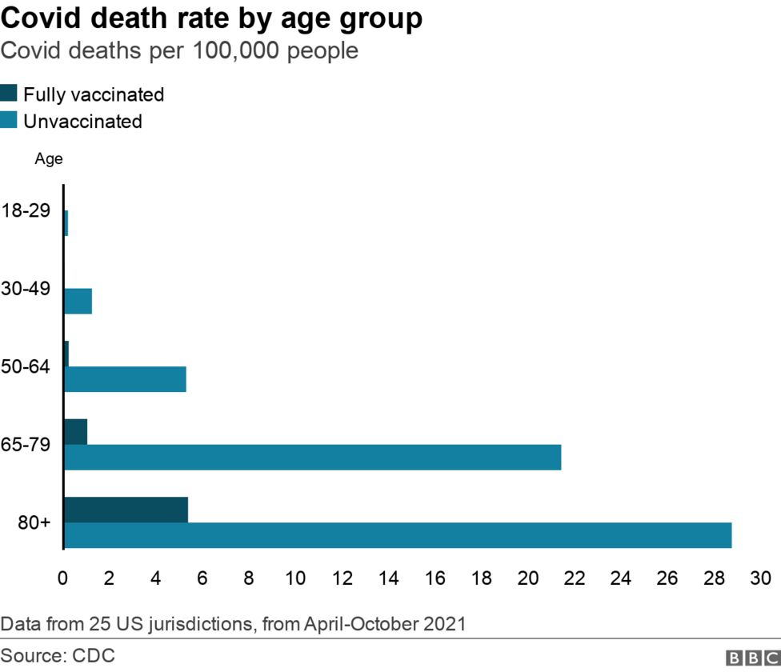

```{r setup, include=FALSE}
knitr::opts_chunk$set(echo = FALSE)
```

```{r libs}

library(cowplot)
library(ggplot2)

```

## Je to pravda?

<blockquote>
Vaccinated English adults under 60 are dying at twice the rate of unvaccinated people the same age.
</blockquote>


Zdroj [ZDE](https://alexberenson.substack.com/p/vaccinated-english-adults-under-60)

## Data jsou skutečná...

Graf v článku vychází z dat zveřejněných ONS (Office for National Statistics, britský staťák).


{width=80%}

## Jaké otázky bychom si mohli klást?

> - Úmrtí v důsledku covidu, nebo obecně?
> - Věkový interval 10 až 59 let? Není to trochu moc?
> - Jak jsou očkovaní a neočkovaní rozloženi v tomto intervalu?

## Co se děje v agregovaných datech?

<blockquote>
[Professor Jeffrey Morris]estimated that the annual mortality rate at the older end of the 10-59 age spectrum would be more than 50 times higher than the mortality rate at the younger end of the spectrum, with 478.2 per 100,000 deaths among 55-59 year olds and 8.8 per 100,000 among 10-14 year olds.
</blockquote>


## Verdikt REUTERS FACT CHECK

<blockquote>
Misleading. It is true that the 10-59 age group has a higher rate of mortality for vaccinated individuals. However, this is not due to vaccines causing deaths but a result of higher vaccination rates among older age groups in the range, who also have higher mortality rates.
</blockquote>

[Celý článek Reuters Fact Check](https://www.reuters.com/article/factcheck-coronavirus-britain-idUSL1N2SN1P4)

## A jen smrti způsobené covidem?

{width=80%}

[Celý článek BBC]("https://www.bbc.com/news/59757395")

## Simpsonův paradox

```{r}
p1 <- ggdraw() + draw_image("figures/05_Simpson_wiki_groups.png", scale = 0.9)
p2 <- ggdraw() + draw_image("figures/05_Simpson_wiki_combined.png", scale = 0.9)

plot_grid(p1, p2)
```

Spousty ilustrativních videí na YouTube.

