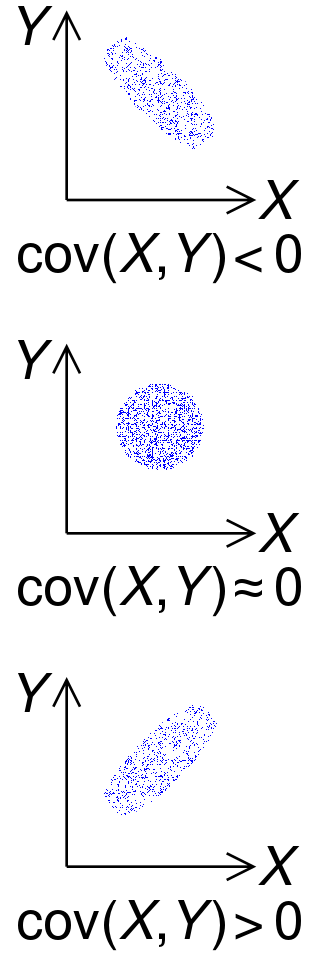
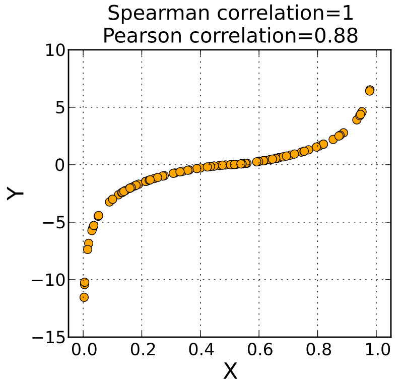
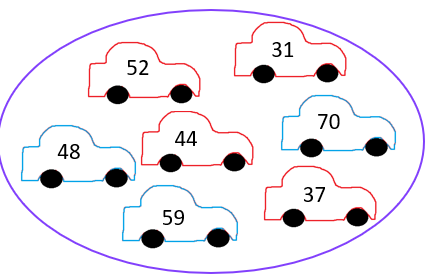
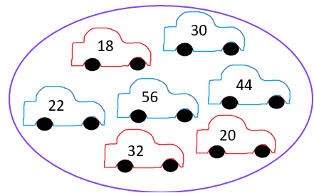

```{r setup, include=FALSE}
knitr::opts_chunk$set(echo = FALSE, warning = FALSE, message = FALSE)
```

```{r libs}

library(tidyverse)
library(cowplot)
library(vcd) # for mosaic plot
library(gapminder)
library(ggrepel)
data("UCBAdmissions") # for Berkeley data
data("gapminder")

```

```{=html}
<style>
.forceBreak { -webkit-column-break-after: always; break-after: column; }
</style>
```

## Gapminder, 30 evropských zemí, 2007

```{r}

p <- gapminder %>% 
  filter(year == 2007, continent == "Europe") %>% 
  ggplot(aes(x=gdpPercap, y=lifeExp))+
  geom_point()+
  geom_text_repel(data = gapminder %>% filter(continent == "Europe", year == 2007, country == "Czech Republic"),
                  aes(label = country))+
  labs(x = "HDP na osobu v USD", y = "Naděje na dožití" )


ggExtra::ggMarginal(p, type = "histogram")
  
```


# Kovariance


## Kovariance {.columns-2 .smaller}

Míra toho, jak dvě proměnné variují společně. 

<p class="forceBreak">

</p>

{width=35%}

<font size="2">[Zdroj Wiki](https://en.wikipedia.org/wiki/Covariance)</font>

:::{.notes}
Provizorně a ve vztahu k prvnímu slajdu (vztah HDP a naděje na dožití) lze říct: pokud by nám informace o HDP na osobu dané země neřekla nic o naději na dožití, mezi proměnnými by byla nulová kovariance. Pokud by větší hodnota HDP na osobu predikovaly větší naději na dožití, šlo by o kladnou kovarianci. Pokud větší hodnoty HDP na hlavu predikují menší hodnoty naděje na dožití, jde o zápornou kovarianci.
:::


## Kovariance - výpočet

Pro připomenutí rozptyl neboli variance:

$$
var(X) = E[(X - E[X])^2]
$$
Lze rozepsat:

$$
var(X) = E[(X - E[X]) * (X - E[X])]
$$


<br>
<br>
Kovariance:

$$
cov(X,Y) = E[(X - E[X]) * (Y - E[Y])]
$$

:::{.notes}
Sledujeme dvě hodnoty, rozdíl $X_i$ a $\bar{X}$ a rozdíl $Y_i$ a $\bar{Y}$. Pokud jsou obě kladné, kovariance roste. Pokud jsou obě záporné, také roste. Naopak pokud je jedna kladná a druhá záporná, kovariance klesá. 
:::

## Korelace

Hodnoty  kovariance, stejně jako hodnoty rozptylu, nejsou samy o sobě příliš vypovídající (teoreticky nabývají hodnoty od minus nekonečna do plus nekonečna). Proto využíváme standardizovanou verzi kovariance, tedy korelaci, která nabývá hodnot od -1 do 1.

Hodnoty -1 a +1 odpovídají dokonalému lineárnímu vztahu, jako známe z fyzikálních zákonů. 


## Pearsonův korelační koeficient

Ta korelace. Bez upřesnění máme korelací zpravidla Pearsonův korelační koeficient. Značíme řeckým $\rho$ (ró), případně také malým písmenem r. 

Výpočet je nadstavba:

$$
\rho = cov(X,Y) / (\sigma_X*\sigma_Y)
$$
Pearsonův korelační koeficient vypočítáme tak, že kovarianci vydělíme součinem směrodatných odchylek obou proměnných.

:::{.notes}
Podobně jako u rozptylu a směrodatné odchylky, také u kovariance a korelace existuje verze výpočtu pro populaci a verze výpočtu pro vzorek. Nás toto komputační rozlišení nebude trápit, příslušné vzorce lze dohledat na anglické Wikipedii.
:::

## Korelace zachycuje lineární vztah

<div class="centered">
{width=90%}
</div>

<font size="2">[Zdroj Wiki](https://en.wikipedia.org/wiki/Correlation)</font>

## Spearmanův korelační koeficient

Také Spearmanův koeficient pořadové korelace: převede pozorování na pořadí, z nich se vypočítá Pearsonův koeficient. Značí se také $\rho$, takže v tom může být trochu zmatek.


<div class="centered">
{width=45%}
</div>

<font size="2">[Zdroj Wiki](https://en.wikipedia.org/wiki/Spearman%27s_rank_correlation_coefficient)</font>

## Jak spočítat Pearsonův a Spearmanův korelační koeficient v Excelu?

Pearsonův korelační koeficient lze snadno vypočítat funkci "PEARSON", resp. "CORREL" (z historických důvodů vývoje softwaru jsou zde dvě stejně se chovající funkce).

Spearmanův korelační koeficient vlastní funkci nemá, ale stačí původní hodnoty převést na pořadí a pak spočítat Pearsonův koeficient. 


## Kendallův korelační koeficient $\tau$ (nadstavba)

Značí se řeckým písmenem $\tau$ (tau). Také pořadový koeficient korelace, ale založený na jiném principu výpočtu než Spearmanův koeficient. Zatímco Spearmanův korelační koeficient používáme na kardinální proměnné s (výrazně) nesymetrickým tvarem (šikmá data), Kendallův koeficient je doporučen k použití pro ordinální data, často je tedy používán spolu s kontingenčními tabulkami (pokud obě proměnné jsou kardinální). 

Existuje více verzí koeficientu:

- Kendallův koeficient $\tau$ - b se doporučuje používat pro čtvercové kontingenční tabulky
- Kendallův koeficient $\tau$ - b se doporučuje používat pro obdélníkové kontingenční tabulky


:::{.notes}
Pro zájemce je výpočet snadno dohledatelný a relativně snadno pochopitelný na anglické Wikipedii.
:::


## Vyčíslení vztahu mezi HDP na osobu a nadějí na dožití {.columns-2 .smaller}

- Jakou výši Personova korelačního koeficientu odhadujete?
- Lze z pohledu na data říct, jestli bude větší Pearsonův, nebo Spearmanův korelační koeficient?
- Kterému z obou koeficientů byste dali přednost?

<p class="forceBreak">

</p>

```{r fig.width=4}

p <- gapminder %>% 
  filter(year == 2007, continent == "Europe") %>% 
  ggplot(aes(x=gdpPercap, y=lifeExp))+
  geom_point()+
  geom_text_repel(data = gapminder %>% filter(continent == "Europe", year == 2007, country == "Czech Republic"),
                  aes(label = country))+
  labs(x = "HDP na osobu v USD", y = "Naděje na dožití" )


ggExtra::ggMarginal(p, type = "histogram")
  
```


:::{.notes}
Hodnota Personova koeficientu je 0.58. Spearman je 0.83. Přednost bych dal Pearsonovu koeficientu: Je to základní korelační koeficient (lidé ho spíše očekávají), zajímá mě, jak společně variují sledované proměnné, nikoliv pouze pořadí (to je trochu nouzovka, když mají data opravdu podivný tvar), rozdělení obou proměnných je docela v pohodě, není tam extrémně silná asymetrie.
:::

# Korelace a kauzalita

## Korelace není kauzalita

>- Čím více hasičských aut zasahuje při požáru, tím větší škody.
>- Děti, které jsou doučovány, mají horší známky než ty, které doučovány nejsou.
>- Čím více zmrzliny se prodá, tím více lidí se utopí.
>- Děti, které spí s rozsvíceným světlem, spíše v dospělosti trpí krátkozrakostí.
>- Mezi žáky v první třídě je souvislost mezi školními výsledky a znamením zvěrokruhu.
>- Lidé s kratším předloktím žijí déle.

## Kauzalita nemusí nutně znamenat korelaci

Kauzální vztahy jsou komplexní a mohou působit proti sobě. Například počet let formálního vzdělání může být příčinou vyššího příjmu. Mladší lidí mají častěji vyšší počet let vzdělání. Také seniorita může být příčinou vyššího příjmu. Starší lidé mají často vyšší senioritu. Ve výsledku se tak mohou oba kuazální vztahy "vyrušit", takže korelaci nebudeme pozorovat. 

## Vizuální odhad míry kauzality

```{r}
complement <- function(y, rho, x) {
  if (missing(x)) x <- rnorm(length(y)) # Optional: supply a default if `x` is not given
  y.perp <- residuals(lm(x ~ y))
  rho * sd(y.perp) * y + y.perp * sd(y) * sqrt(1 - rho^2)
}

y <- rnorm(50, sd=10)
x <- 1:50 # Optional
rho <- c(0, 0.2, 0.4, 0.6, 0.8, 1)
X <- data.frame(z=as.vector(sapply(rho, function(rho) complement(y, rho, x))),
                rho=ordered(rep(signif(rho, 2), each=length(y))),
                y=rep(y, length(rho)))
    

ggplot(X, aes(y,z, group=rho)) + 
  geom_smooth(method="lm", se=FALSE) + 
  geom_rug(sides="b") + 
  geom_point(aes(fill=rho), alpha=1/2, shape=21) +
  facet_wrap(~ rho)
```

<font size="1"> Code by whuber from: <https://stats.stackexchange.com/questions/15011/generate-a-random-variable-with-a-defined-correlation-to-an-existing-variables></font>

## Klasifikace korelačního koeficientu dle síly

Kolují různá doporučení, jak interprertovat:

- 0.1 ... slabá asociace
- 0.3 ... středně silná asociace
- 0.5 ... silná asociace

Silně nedoporučuji taková doporučení používat! Záleží na kontextu.

:::{.notes}
Existují obrovské rozdíly mezi obory. Pokud nějaký jev predikuje růst akciového trhu tak, že mezi oběma proměnnými existuje korelace 0.1, může jít o silnou asociaci z hlediska makléře. Naopak pokud třeba biologivé studují odpověď buňky na chemickou látku v Petriho misce, může být, v závislosti na kontextu, korelace 0.9 velmi nízká. V některých oblastech fyziky může být korelace 0.99 nízká. V sociologii záleží také na tom, jestli jde o korelaci na individuální úrovni (mezi vlastnostmi jednotlivců), kde zpravidla pozoroujeme nižší korelace než na úrovni agregovaných celků (okresů, organizací, států atp.). Nicméně lze říct, že pokud je korelace 0.1, těžko si lze v sociologii představit kontext, kdy by to něco znamenalo. Nejmenší korealace, které vůbec v socilogii stojí za zmínku, budou kolem 0.2.
:::

## Korelace je míra lineární asociace, ale není to lineární metrika síly vztahu

Interpretace korelačního koeficientu: Piersonův korelační koeficient na druhou vyjadřuje podíl rozptylu v jedné proměnné, který dokážeme predikovat při znalosti druhé proměnné.  


:::{.notes}
Co to znamená: Nárůst korelace z 0.1 na 0.2 nepředstavuje stejný posun v síle vztahu jako nárůst z 0.2 na 0.3. Pokud se korelační koeficient zdvojnásobí, nelze říct, že se zdvojnásobila síla asociace mezi proměnnými (ta totiž vzroste více). Korelační koeficient 0.1 = znalost jedné proměnné nám umožňuje predikovat 0.01, tedy 1 % rozptylu druhé proměnné. Korelační koeficient 0.2 = 4 %, 0.3 = 9 % ... 0.6 = 36 % atd. 
:::


# Vztahy mezi proměnnými v agregovaných datech

## Vztah nehodovosti a příjmu {.columns-2 .smaller}


Spočítejte 

  - průměrný příjem ve svém městě
  - průměrnou nehodovost ve svém městě (jako šanci, nikoliv pravděpodobnost, že daná domácnost v daném roce nabourá)
  

<font size="1"> Inspirováno [Eliyabeth Lynch](https://www.youtube.com/watch?v=8Mpi10MRhDU) </font>


<p class="forceBreak">

</p>
  
{width=65%}
{width=65%}
{width=65%}

## Přijetí na Univerzitu v Berkeley dle pohlaví

```{r}
mosaic( ~ Gender + Admit, data = UCBAdmissions)
```

## Zohlednění fakult

```{r}
rownames(UCBAdmissions) <- c("A", "R")

mosaic( ~ Dept + Gender + Admit, data = UCBAdmissions,
       highlighting = "Admit", highlighting_fill = c("lightgreen", "pink"),
       direction = c("v","h","v"))


```


## Obecný problém: Simpsonův paradox

```{r}
p1 <- ggdraw() + draw_image("figures/05_Simpson_wiki_groups.png", scale = 0.9)
p2 <- ggdraw() + draw_image("figures/05_Simpson_wiki_combined.png", scale = 0.9)

plot_grid(p1, p2)
```

Zdroj [Wikipedie](https://en.wikipedia.org/wiki/Simpson%27s_paradox)

## Jak poznat, jestli vztah na agregované úrovni platí i na úrovni individuální?

>- Potřebujeme data na individuální úrovni

