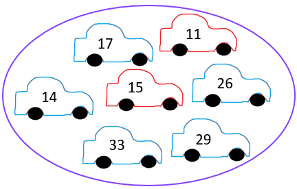

```{r setup, include=FALSE}
knitr::opts_chunk$set(echo = FALSE, warning = FALSE, message = FALSE)
```

```{r libs}

library(tidyverse)
library(cowplot)
library(vcd) # for mosaic plot
library(gapminder)
library(ggrepel)
data("UCBAdmissions") # for Berkeley data
data("gapminder")

```

```{=html}
<style>
.forceBreak { -webkit-column-break-after: always; break-after: column; }
</style>
```

## Gapminder, 30 evropských zemí, 2007

```{r}

p <- gapminder %>% 
  filter(year == 2007, continent == "Europe") %>% 
  ggplot(aes(x=gdpPercap, y=lifeExp))+
  geom_point()+
  geom_text_repel(data = gapminder %>% filter(continent == "Europe", year == 2007, country == "Czech Republic"),
                  aes(label = country))+
  labs(x = "HDP na osobu v USD", y = "Naděje na dožití" )


ggExtra::ggMarginal(p, type = "histogram")
  
```


# Kovariance


## Kovariance {.columns-2 .smaller}

Míra toho, jak dvě proměnné variují společně. 

<p class="forceBreak">

</p>

{width=35%}

<font size="2">[Zdroj Wiki](https://en.wikipedia.org/wiki/Covariance)</font>

:::{.notes}
Provizorně a ve vztahu k prvnímu slajdu (vztah HDP a naděje na dožití) lze říct: pokud by nám informace o HDP na osobu dané země neřekla nic o naději na dožití, mezi proměnnými by byla nulová kovariance. Pokud by větší hodnota HDP na osobu predikovaly větší naději na dožití, šlo by o kladnou kovarianci. Pokud větší hodnoty HDP na hlavu predikují menší hodnoty naděje na dožití, jde o zápornou kovarianci.
:::


## Kovariance - výpočet (nadstavba)

Pro připomenutí: rozptyl, neboli variance:

$$
var(X) = E[(X - E[X])^2] = E[(X - E[X]) * (X - E[X])]
$$
Kovariance:

$$
cov(X,Y) = E[(X - E[X]) * (Y - E[Y])]
$$

:::{.notes}
Sledujeme dvě hodnoty, rozdíl $X_i$ a $\bar{X}$ a rozdíl $Y_i$ a $\bar{Y}$. Pokud jsou obě kladné, kovariance roste. Pokud jsou obě záporné, také roste. Naopak pokud je jedna kladná a druhá záporná, kovariance klesá. 
:::

## Korelace

Hodnoty  kovariance, stejně jako hodnoty rozptylu, nejsou samy o sobě příliš vypovídající (teoreticky nabývají hodnoty od minus nekonečna do plus nekonečna). Proto využíváme standardizovanou verzi kovariance, tedy korelaci, která nabývá hodnot od -1 do 1.

Hodnoty -1 a +1 odpovídají dokonalému lineárnímu vztahu, jako známe z fyzikálních zákonů. 


## Pearsonův korelační koeficient

Ta korelace. Bez upřesnění máme korelací zpravidla Pearsonův korelační koeficient. Značíme řeckým $\rho$ (ró), případně také malým písmenem r. 

Výpočet je nadstavba:

$$
\rho = cov(X,Y) / \sigma_X*\sigma_Y
$$
Pearsonův korelační koeficient vypočítáme tak, že kovarianci vydělíme součinem směrodatných odchylek obou proměnných.

:::{.notes}
Podobně jako u rozptylu a směrodatné odchylky, také u kovariance a korelace existuje verze výpočtu pro populaci a verze výpočtu pro vzorek. Nás toto komputační rozlišení nebude trápit, příslušné vzorce lze dohledat na anglické Wikipedii.
:::

## Korelace zachycuje lineární vztah

<div class="centered">
{width=90%}
</div>

<font size="2">[Zdroj Wiki](https://en.wikipedia.org/wiki/Correlation)</font>

## Spearmanův korelační koeficient

Také Spearmanův koeficient pořadové korelace: převede pozorování na pořadí, z nich se vypočítá Pearsonův koeficient. Značí se také $\rho$, takže v tom může být trochu zmatek.


<div class="centered">
{width=45%}
</div>

<font size="2">[Zdroj Wiki](https://en.wikipedia.org/wiki/Spearman%27s_rank_correlation_coefficient)</font>


## Kendallův korelační koeficient $\tau$ (nadstavba)

Značí se řeckým písmenem $\tau$ (tau). Také pořadový koeficient korelace, ale založený na jiném principu výpočtu než Spearmanův koeficient. Zatímco Spearmanův korelační koeficient používáme na kardinální proměnné s (výrazně) nesymetrickým tvarem (šikmá data), Kendallův koeficient je doporučen k použití pro ordinální data, často je tedy používán spolu s kontingenčními tabulkami (pokud obě proměnné jsou kardinální). 

Existuje více verzí koeficientu:

- Kendallův koeficient $\tau$ - b se doporučuje používat pro čtvercové kontingenční tabulky
- Kendallův koeficient $\tau$ - b se doporučuje používat pro obdélníkové kontingenční tabulky


:::{.notes}
Pro zájemce je výpočet snadno dohledatelný a relativně snadno pochopitelný na anglické Wikipedii.
:::


## Vyčíslení vztahu mezi HDP na osobu a nadějí na dožití {.columns-2 .smaller}

- Jakou výši Personova korelačního koeficientu odhadujete?
- Lze z pohledu na data říct, jestli bude větší Pearsonův, nebo Spearmanův korelační koeficient?
- Kterému z obou koeficientů byste dali přednost?

<p class="forceBreak">

</p>

```{r fig.width=4}

p <- gapminder %>% 
  filter(year == 2007, continent == "Europe") %>% 
  ggplot(aes(x=gdpPercap, y=lifeExp))+
  geom_point()+
  geom_text_repel(data = gapminder %>% filter(continent == "Europe", year == 2007, country == "Czech Republic"),
                  aes(label = country))+
  labs(x = "HDP na osobu v USD", y = "Naděje na dožití" )


ggExtra::ggMarginal(p, type = "histogram")
  
```


:::{.notes}
Hodnota Personova koeficientu je 0.58. Spearman je 0.83. Přednost bych dal Pearsonovu koeficientu: Je to základní korelační koeficient (lidé ho spíše očekávají), zajímá mě, jak společně variují sledované proměnné, nikoliv pouze pořadí (to je trochu nouzovka, když mají data opravdu podivný tvar), rozdělení obou proměnných je docela v pohodě, není tam extrémně silná asymetrie.
:::

# Korelace a kauzalita

## TBD Korelace není kauzalita

(Přidat pár snímků, kde to bude krátce ilustrováno, více to proberou v metodách.)


## TBD Obrázky korelace

(Přidat pár obrázků, kde si vyzkouší odhadnout, jak vysoká je kde korelace, případně co se kde stane s korelací, když přibyde nebo ubyde jedno pozorování.)

# Vztahy mezi proměnnými v agregovaných datech

## Vztah nehodovosti a příjmu {.columns-2 .smaller}


Spočítejte 

  - průměrný příjem ve svém městě
  - průměrnou nehodovost ve svém městě
  


Inspirováno [Eliyabeth Lynch](https://www.youtube.com/watch?v=8Mpi10MRhDU)

<p class="forceBreak">

</p>
  
{width=65%}
{width=65%}
{width=65%}

  
## Je to pravda?

<blockquote>
Vaccinated English adults under 60 are dying at twice the rate of unvaccinated people the same age.
</blockquote>


Zdroj [ZDE](https://alexberenson.substack.com/p/vaccinated-english-adults-under-60)

## Data jsou skutečná...

Graf v článku vychází z dat zveřejněných ONS (Office for National Statistics, britský staťák).


{width=80%}

## Jaké otázky bychom si mohli klást?

> - Úmrtí v důsledku covidu, nebo obecně?
> - Věkový interval 10 až 59 let? Není to trochu moc?
> - Jak jsou očkovaní a neočkovaní rozloženi v tomto intervalu?

## Co se děje v agregovaných datech?

<blockquote>
Professor Jeffrey Morris estimated that the annual mortality rate at the older end of the 10-59 age spectrum would be more than 50 times higher than the mortality rate at the younger end of the spectrum, with 478.2 per 100,000 deaths among 55-59 year olds and 8.8 per 100,000 among 10-14 year olds. [Reuters Fact Check](https://www.reuters.com/article/factcheck-coronavirus-britain-idUSL1N2SN1P4)
</blockquote>


## Verdikt REUTERS FACT CHECK

<blockquote>
Zavádějící. Je pravda, že ve věkové skupině 10-59 let je vyšší míru úmrtnosti u očkovaných jedinců. Není to však důsledkem toho, že by očkování způsobovalo úmrtí, ale důsledkem vyšší míry očkování u starších věkových skupin v tomto širokém věkovém rozpětí, přičemž starší mají také vyšší úmrtnost.
</blockquote>

[Celý článek Reuters Fact Check](https://www.reuters.com/article/factcheck-coronavirus-britain-idUSL1N2SN1P4)

## A jen smrti způsobené covidem?

{width=60%}

[Celý článek BBC]("https://www.bbc.com/news/59757395")

## Přijetí na Univerzitu v Berkeley dle pohlaví

```{r}
mosaic( ~ Gender + Admit, data = UCBAdmissions)
```

## Zohlednění fakult

```{r}
rownames(UCBAdmissions) <- c("A", "R")

mosaic( ~ Dept + Gender + Admit, data = UCBAdmissions,
       highlighting = "Admit", highlighting_fill = c("lightgreen", "pink"),
       direction = c("v","h","v"))


```


## Obecný problém: Simpsonův paradox

```{r}
p1 <- ggdraw() + draw_image("figures/05_Simpson_wiki_groups.png", scale = 0.9)
p2 <- ggdraw() + draw_image("figures/05_Simpson_wiki_combined.png", scale = 0.9)

plot_grid(p1, p2)
```

Zdroj [Wikipedie](https://en.wikipedia.org/wiki/Simpson%27s_paradox)

