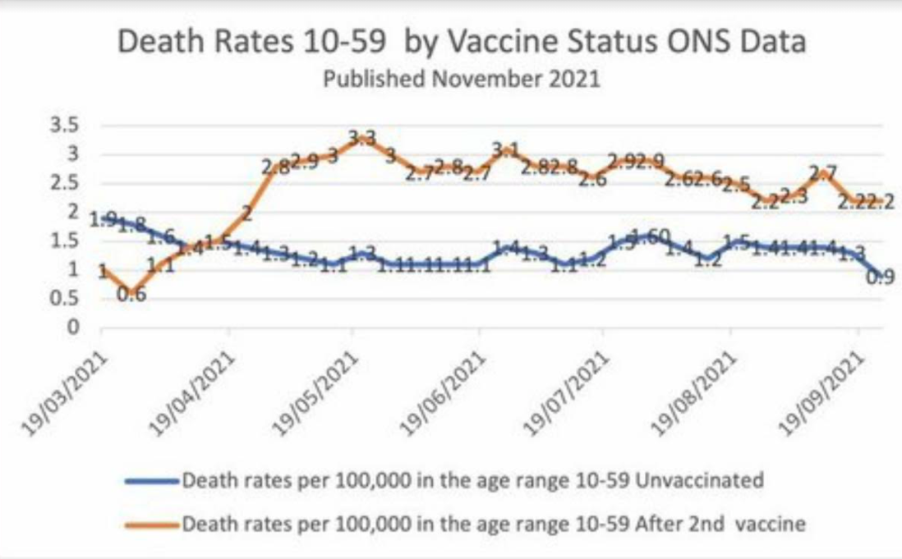

```{r setup, include=FALSE}
knitr::opts_chunk$set(echo = FALSE, warning = FALSE, message = FALSE)
```

```{r libs}

library(tidyverse)
library(cowplot)
library(vcd) # for mosaic plot
library(gapminder)
library(ggrepel)
data("UCBAdmissions") # for Berkeley data
data("gapminder")

```

```{=html}
<style>
.forceBreak { -webkit-column-break-after: always; break-after: column; }
</style>
```

## Gapminder, 30 evropských zemí, 2007

```{r}

p <- gapminder %>% 
  filter(year == 2007, continent == "Europe") %>% 
  ggplot(aes(x=gdpPercap, y=lifeExp))+
  geom_point()+
  geom_text_repel(data = gapminder %>% filter(continent == "Europe", year == 2007, country == "Czech Republic"),
                  aes(label = country))+
  labs(x = "HDP na osobu v USD", y = "Naděje na dožití" )


ggExtra::ggMarginal(p, type = "histogram")
  
```


# Kovariance

## Opakování: Variance

Měřítko toho, jak moc jednotlivá pozorování dané proměnné variují. 

$$
var(X) = \frac{\sum (x_i - \mu_x)^2}{n}
$$

## Kovariance


## Vztah nehodovosti a příjmu {.columns-2 .smaller}


Spočítejte 

  - průměrný příjem ve svém městě
  - průměrnou nehodovost ve svém městě
  


Inspirováno [Eliyabeth Lynch](https://www.youtube.com/watch?v=8Mpi10MRhDU)

<p class="forceBreak">

</p>
  
{width=65%}
{width=65%}
{width=65%}
  
  
## Je to pravda?

<blockquote>
Vaccinated English adults under 60 are dying at twice the rate of unvaccinated people the same age.
</blockquote>


Zdroj [ZDE](https://alexberenson.substack.com/p/vaccinated-english-adults-under-60)

## Data jsou skutečná...

Graf v článku vychází z dat zveřejněných ONS (Office for National Statistics, britský staťák).


{width=80%}

## Jaké otázky bychom si mohli klást?

> - Úmrtí v důsledku covidu, nebo obecně?
> - Věkový interval 10 až 59 let? Není to trochu moc?
> - Jak jsou očkovaní a neočkovaní rozloženi v tomto intervalu?

## Co se děje v agregovaných datech?

<blockquote>
Professor Jeffrey Morris estimated that the annual mortality rate at the older end of the 10-59 age spectrum would be more than 50 times higher than the mortality rate at the younger end of the spectrum, with 478.2 per 100,000 deaths among 55-59 year olds and 8.8 per 100,000 among 10-14 year olds. [Reuters Fact Check](https://www.reuters.com/article/factcheck-coronavirus-britain-idUSL1N2SN1P4)
</blockquote>


## Verdikt REUTERS FACT CHECK

<blockquote>
Zavádějící. Je pravda, že ve věkové skupině 10-59 let je vyšší míru úmrtnosti u očkovaných jedinců. Není to však důsledkem toho, že by očkování způsobovalo úmrtí, ale důsledkem vyšší míry očkování u starších věkových skupin v tomto širokém věkovém rozpětí, přičemž starší mají také vyšší úmrtnost.
</blockquote>

[Celý článek Reuters Fact Check](https://www.reuters.com/article/factcheck-coronavirus-britain-idUSL1N2SN1P4)

## A jen smrti způsobené covidem?

{width=80%}

[Celý článek BBC]("https://www.bbc.com/news/59757395")

## Přijetí na Univerzitu v Berkeley dle pohlaví

```{r}
mosaic( ~ Gender + Admit, data = UCBAdmissions)
```

## Zohlednění departmentů

```{r}
rownames(UCBAdmissions) <- c("A", "R")

mosaic( ~ Dept + Gender + Admit, data = UCBAdmissions,
       highlighting = "Admit", highlighting_fill = c("lightblue", "pink"),
       direction = c("v","h","v"))


```


## Obecný problém: Simpsonův paradox

```{r}
p1 <- ggdraw() + draw_image("figures/05_Simpson_wiki_groups.png", scale = 0.9)
p2 <- ggdraw() + draw_image("figures/05_Simpson_wiki_combined.png", scale = 0.9)

plot_grid(p1, p2)
```

Zdroj [Wikipedie](https://en.wikipedia.org/wiki/Simpson%27s_paradox)

