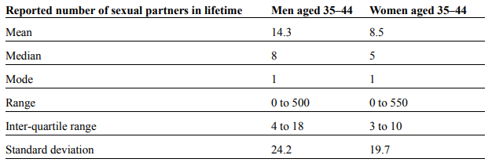
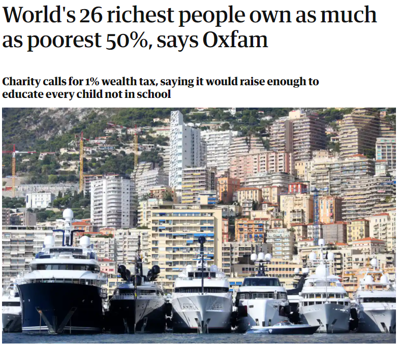
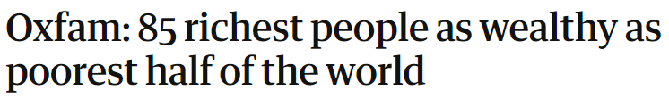
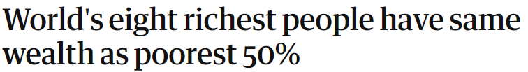
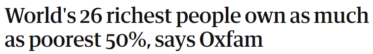
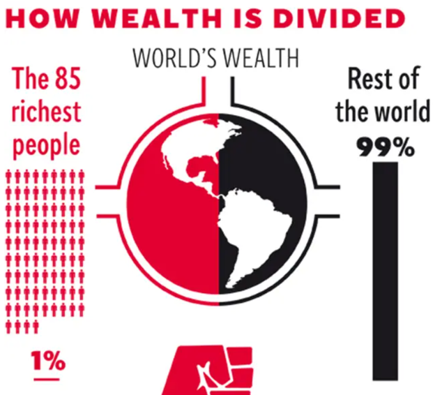
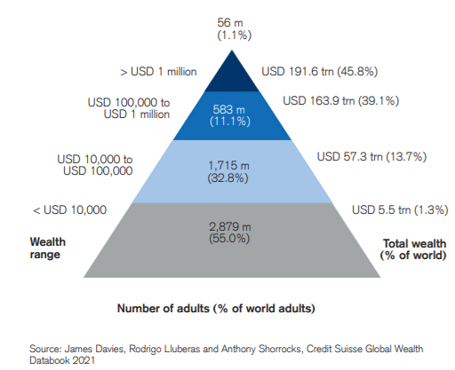
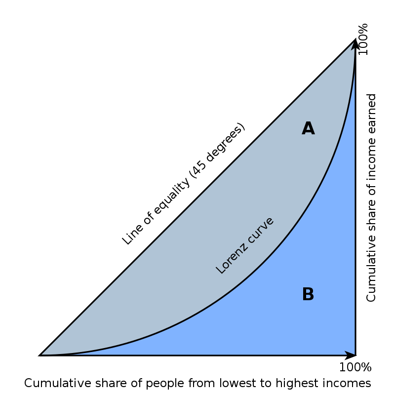

```{r setup, include=FALSE}
knitr::opts_chunk$set(echo = FALSE, warning = FALSE, message = FALSE)
```

```{r libs}
library(tidyverse)
library(here)
library(ggpmisc) # to add table to ggplot2 object
```

```{=html}
<style>
.forceBreak { -webkit-column-break-after: always; break-after: column; }
</style>
```

## Opakování

Kardinální data

-   tvar dat graficky (histogram, boxplot, bodový graf)
-   popis centrální tendence (průměr, medián, modus)

> -   Dnes: Číselný popis variability dat

## Výzkum sexuálního života

-   britský výzkum Natsal-3, 2010-2012, N \> 2000, nyní se plánuje čtvrté kolo

-   Uváděný počet sexuálních partnerů, srovnání žen a mužů ve věku 35-44 let

    -   Jaký minimální a jaký maximální počet partnerů byl uveden ve skupině žen? mužů?

> -   Muži minimum: 0, Muži maximum: 500
> -   Ženy minimum: 0, Ženy maximum: 550

::: {.notes}
Minimum by nemělo být překvapivé, jde o velký vzorek. Co vypovídá maximum o obou podskupinách? Pravděpodobně téměř nic...
:::

## (Variační) rozpětí a mezikvartilové rozpětí

-   (Variační) rozpětí = MAX - MIN
-   Mezikvartilové rozpětí = Q3 - Q1
-   Kterou z těchto statistik můžeme považovat za robustní?

> -   Mezikvartilové rozpětí muži: 4 až 18
> -   Mezikvartilové rozpězí ženy: 3 až 10

## Porovnání variačního a mezikvartilového rozpětí 1/3

```{r}
set.seed(13)
population <- rpois(1000, lambda = 2)
pop <- tibble(value = population)
pop_graph <- pop %>% ggplot(aes(x=value))+geom_bar()+scale_x_continuous(breaks = c(0:9))+
  labs(title = "Simulovaná data",
       x = "Hodnota proměnné",
       y = "# v tisícové populaci s danou hodnotou proměnné")

pop_table <- pop %>% summarise(min = min(value), max = max(value), Q1 = quantile(value, 0.25), Q3 = quantile(value, 0.75))

odhady_30 <- tibble()

for (i in 1:20) {
  odhady_30 <- bind_rows(odhady_30,
                      pop %>% 
                        sample_n(30) %>% 
                        summarise(min = min(value), max = max(value), Q1 = quantile(value, 0.25), Q3 = quantile(value, 0.75)))
}


odhady_300 <- tibble()

for (i in 1:20) {
  odhady_300 <- bind_rows(odhady_300,
                      pop %>% 
                        sample_n(300) %>% 
                        summarise(min = min(value), max = max(value), Q1 = quantile(value, 0.25), Q3 = quantile(value, 0.75)))
}


pop_graph +                                             
  annotate(geom = "table",
           x = 9,
           y = 250,
           label = list(pop_table))


```

## Porovnání variačního (červené) a mezikvartilového (modré) rozpětí 2/3

```{r}

odhady_30 %>% 
  rownames_to_column() %>% 
  ggplot(aes(x = as.numeric(rowname)))+
  geom_linerange(aes(ymin = min, ymax = max), color = "red")+
  geom_linerange(aes(ymin = Q1, ymax = Q3), color = "blue", size = 1.5)+
  scale_y_continuous(breaks = c(0:9))+
  scale_x_continuous(breaks = c(1:20))+
  labs(x="Vzorek",
       title = "Dvacet vzorků po třiceti pozorováních")

```

## Porovnání variačního (červené) a mezikvartilového (modré) rozpětí 3/3

```{r}

odhady_300 %>% 
  rownames_to_column() %>% 
  ggplot(aes(x = as.numeric(rowname)))+
  geom_linerange(aes(ymin = min, ymax = max), color = "red")+
  geom_linerange(aes(ymin = Q1, ymax = Q3), color = "blue", size = 1.5)+
  scale_y_continuous(breaks = c(0:9))+
  scale_x_continuous(breaks = c(1:20))+
  labs(x="Vzorek",
       title = "Dvacet vzorků po 300 pozorováních")

```

## Vyjádřit charakteristiky dat číslem je užitečné...

... Ale obrázek často řekne víc než mnoho čísel

<div class="centered">
{width="50%"}
</div>

<font size="2">Převzato z @spiegelhalter2019</font>

# Rozptyl a směrodatná odchylka

## Rozptyl (variance)

-   Také disperze, variance, střední kvadratická odchylka.
-   Zkusme odvodit, co je roptyl, z označení "střední kvadratická odchylka"

## Rozptyl formálně

Proměnná $x$ má $n$ pozorování. Potom rozptyl proměnné je definován:

$$
var(X) = \frac{\sum (x_i - \mu_x)^2}{n}
$$

kde $x_i$ je i-té pozorování, řecké písmeno $\mu$ se čte mjů a značí průměr proměnné x.

## Výběrový rozptyl (rozptyl vzorku dat)

$$
s^2_X = \frac{\sum (x_i - \bar{x})^2}{n-1}
$$

Rozptyl se počítá (maličko) odlišně, pokud naše data považujeme za vzorek populace (nikoliv za celou poplaci). Ve vzorci výše nyní dělíme jmenovatelem (n-1), namísto pouze n. Výběrový rozptyl je zvykem značit $s^2$. 

Je výběrový rozptyl větší nebo menší číslo než rozptyl?


::: {.notes}
Odpověď: větší, dělíme-li menším číslem, je výsledek větsí. Důvod, proč to děláme? Při výpočtu rozptylu používáme průměr. Ovšem pokud jde o vzorek, průměr zpravidla odhadujeme přímo ze vzorku. Tento průměr je blíže jednotlivým hodnotám vzorku, než je pravděpodobně populační průměr. Náš odhad rozptylu tak výběrovým rozptylem podhodnocujeme. Jmenovatel (n-1) má toto podhodnocení kompenzovat. Není potřeba se tím moc trápit, ani tom rozdílu nebudeme bazírovat. Ale je dobré vědět, že něco takového existuje. 
:::


## Třetí možný zápis rozptylu

E ... expectation, tj. očekávaná hodnoa, v podstatě statistický žargon pro průměr.

$$var(X) = E[(X - E[X])^2]$$

## Musím umět rozlišit různé typy a zápisy rozptylu?


$$
var(X) = \frac{\sum (x_i - \mu_x)^2}{n}
$$

$$
s^2 = \frac{\sum (x_i - \bar{x})^2}{n-1}
$$


$$var(X) = E[(X - E[X])^2]$$

>- Odpověď: Ne.

## Rozptyl je v jiných jednotkách než původní proměnná

-   Proto samotný číselný údaj o rozptylu zpravidla neříká nic užitečného pro naši lepší představu. Rozptyl je spíše velmi užitečný mezistupeň pro další počítání.

::: {.notes}
ZŠ úloha: Máme čtverec o straně $a$. Když délku strany zdvojnásobíme, kolikrát se zvětší obsah?
:::

## Směrodatná odchylka

Odmocnina z rozptylu. Ve stejných jednotkách jako původní proměnná. Značíme řeckým sigma.

$$
\sigma_x = \sqrt{var{(X)}}
$$
Případně výběrová směrodatná odchylka: 

$$
s = \sqrt{s^2}
$$


## Je směrodatná odchylka robustní ukazatel variability?

-   Úvahou?

-   Na příkladu:

    -   Směrodatná odchylka z čísel 1, 2, 3, ... 100 (sto pozorování)
    -   Směrodatná odchylka z čísel 1, 2, 3, ... 100, 1000 (sto jedna pozorování)

> -   Směrodatná odchylka není robustní, informativní je proto především jen pro symetrická data.

::: {.notes}
Nerobustní, lze demonstrovat na počítačí, kód v R: sd(c(1:100)), sd(c(1:100,1000)).
:::

## Interpretujte následující tabulku



<font size="2">Převzato z @spiegelhalter2019</font>

## Chudoba a měření variability

Příklad inspirovaný knihou How to Make the World Add Up [@harford2021]

<div class="centered">
{width="60%"}
</div>

<font size="2">Zdroj [The Guardian](https://www.theguardian.com/business/2019/jan/21/world-26-richest-people-own-as-much-as-poorest-50-per-cent-oxfam-report), 2019.</font>

## Jak dobrý je to ukazatel?

{width="50%"}

{width="50%"}

{width="50%"}

## And it gets worse...

{width="70%"}

<font size="2">Zdroj [The Independent](https://www.independent.co.uk/news/world/politics/oxfam-warns-davos-of-pernicious-impact-of-the-widening-wealth-gap-9070714.html)</font>

## Co se měří a kdo to měří?

Pravděpodobně každý v této třídě je bohatší než miliarda nejchudších lidí.

> -   Průzkum Global Wealth Report financovaný bankou Credit Suisse.

> -   Měří čisté bohatství = aktiva jako domy, akcie a hotovost v bance po odečtení případných dluhů. Asi pro miliardu lidí se odhaduje, že má záporný nebo přibližně nulový majetek.

::: {.notes}
Čisté bohatství je dobrá míra bohatství, ale velmi neintuitivní míra chudoby: "If you've just finished an MBA, or law school, or medical school, and you've picked up a few hundred thousand dollars of debt, your net wealth is way below zero. But financially, a young doctor is likely to feel much more comfortable than a young subsistence farmer, even if the doctor is up to her chin in debt and the farmer owns a scrawny cow and a rusty bike for a net worth of \$100." (Tim Harford, How to make the World add up)
:::

## Jak to tedy je?

<div class="centered">

</div>

<font size="2">Zdroj [Global Wealth Report 2021](https://www.credit-suisse.com/about-us/en/reports-research/global-wealth-report.html)</font>

##  {.smaller}

Oxfam's director of campaigns and policy, Matthew Spencer, said:

"The massive fall in the number of people living in extreme poverty is one of the greatest achievements of the past quarter of a century but rising inequality is jeopardising further progress.

The way our economies are organised means wealth is increasingly and unfairly concentrated among a privileged few while millions of people are barely subsisting. Women are dying for lack of decent maternity care and children are being denied an education that could be their route out of poverty. No one should be condemned to an earlier grave or a life of illiteracy simply because they were born poor.

It doesn't have to be this way -- there is enough wealth in the world to provide everyone with a fair chance in life. Governments should act to ensure that taxes raised from wealth and businesses paying their fair share are used to fund free, good-quality public services that can save and transform people's lives."

Zdroj [The Guardian](https://www.theguardian.com/business/2019/jan/21/world-26-richest-people-own-as-much-as-poorest-50-per-cent-oxfam-report)


## Míry hodnocení majetkové nerovnosti {.columns-2 .smaller}

### Takhle ne

-   zaměření na extrémní jednotky nebo desítky případů: kuriozita posílená tím, že nejbohatší miliardy nic nevlastní
-   směrodatná odchylka - používáme jen pro symetrická rozdělení, její sílu si teprve ukážeme v příštích přednáškách

<p class="forceBreak">

</p>

### Takhle možná

-   poměr 50/10, tj, srovnání mediánu a desátého percentilu
-   majetek horního 1 % (používá Piketty) - smysluplnější ukazatel koncentrace majektu na vršku pyramidy

::: {.notes}
Poměr 50:10 i majetek horního 1 % říkají o nerovnosti něco jiného. Je možné, že poměr 50:10 se zmenší (indikuje pokles nerovnosti), ale podíl na majetku horního procenta vzroste (indikuje nárůst nerovnosti).
:::

## Giniho koeficient {.columns-2 .smaller}

-   Dobrá míra variability (nerovnosti) v nesymetrických, šikmých datech (příjmy, majetek, počet sexuálních partnerů,...)
-   Funguje i pro symetrická data (např. Giniho koeficient výšky)
-   Zohledňuje posuny na celém spektru
-   Jednodušší pochopit graficky
-   Hodnoty často dávají smysl jen v komparaci

<p class="forceBreak">

</p>

{width="85%"}

Zdroj [Wiki](https://en.wikipedia.org/wiki/Gini_coefficient)

$$Gini = A/(A+B) $$

## Variační koeficient (VK)

Také "relativní směrodatná odchylka".

Spočítejte směrodatnou odchylku z následujících datových setů:

a) 1, 2, 3
b) 101, 102, 103

## Směrodatná odchylka je stejná...

... ale v prvním data setu se první a druhé pozorování liší o 100 %, zatímco v druhém o necelé procento...

$$VK = \sigma / \mu $$


## Reference v prezentaci {.smaller}

Následuje seznam referencí, které v prezentaci neměly aktivní proklik na zdroj.
